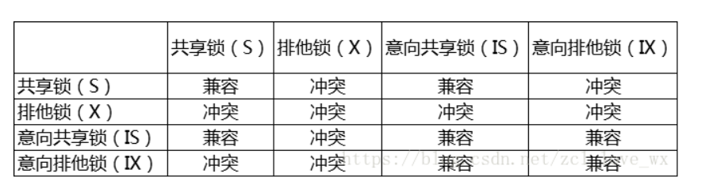

待解决问题：

~~~shell
redis分片不均衡
策略模式
规则引擎
myabtis插件原理

http协议过程

mysql
mysql主从复制
myysql索引
继续mysql
最左前缀

框架研究下吧。dubbo和cloud，mq
应用场景：aop、threadlocal
redis底层实现zset。
布隆过滤器

线程池对应，回收线程方式
线程状态，和系统对应关系
spring常见的异常

Cpu100
设计一个半小时延时的订单支付
~~~

## 个人介绍：

~~~bash
尊敬的面试官您好，我叫李晨琦，来自北京邮电大学。本硕都是在北邮读的，本科期间专业是网络工程，但是整体上课程安排和计科相同，因此系统的学习了各类计算机相关的基础知识；研究生期间在网络与交换国家重点实验室交换与智能中心，个人主要负责一些工程开发工作，对于分布式体系架构等也很感兴趣，因此自学和很多java相关的框架知识和中间件等。实习的话是在阿里云的基础产品事业部，企业IT治理团队，主要负责阿里云全站用户访问凭证的最后使用时间数据服务的链路优化课题，主要是涉及一些大数据相关的知识，包括离线计算和实时计算等，然后设计了双链路计算方案，结合三层缓存机制实现了数据服务的及时性和稳定性，有效提升了服务质量。
~~~

## 算法和数据结构相关

### 一、排序算法

#### 0、表格总结

稳定性的意义：

~~~java
1、如果只是简单的进行数字的排序或者初始顺序没有影响，则毫无意义
//4、除非要排序的内容是一个复杂对象的多个数字属性，且其原本的初始顺序存在意义，那么我们需要在二次排序的基础上保持原有排序的意义，才需要使用到稳定性的算法，
  例如要排序的内容是一组原本按照价格高低排序的对象，如今需要按照销量高低排序，使用稳定性算法，可以使得想同销量的对象依旧保持着价格高低的排序展现，只有销量不同的才会重新排序。（当然，如果需求不需要保持初始的排序意义，那么使用稳定性算法依旧将毫无意义）。
~~~

#### 1、冒泡排序

- 双重循环，遍历后面的所有数据，比自己大则交换，保证自己（第一个元素）是最小的

- 代码：

  

- ==复杂度分析：==
  
  - 空间复杂度：原地交换，O（1）
  - **稳定排序**：当大小相等时不做交换，保证是稳定排序
  - **平均时间复杂度：O(n2)**
  - **复杂度最低时：有序排序，无需交换，复杂度为O(n)**
  - **复杂度最高时：倒序排序，每个n次交换，复杂度为O(n2)**

#### 2、选择排序(了解)

- 双重循环，思想类似，每次找到后面最小的，放到最前面

- 代码：

  

- 总结

  

- ==复杂度分析：==
  - 空间复杂度：选择最小，原地交换，O(1)
  - **稳定排序**：==当后面一个更小的数被选走进行交换放到前面后，会导致与之相等的前面的数的位置移动。无法保证是稳定排序==
  - **平均时间复杂度：O(n2)**
  - 每轮都要遍历后面所有，因此复杂度均为O(n2)

#### 3、插入排序（熟悉）

- 默认前面排好序，从后往前推，比此数大就往后移一个，直到插入空位

- 代码：

  ~~~java
  public class Solution {
      // 插入排序：稳定排序，在接近有序的情况下，表现优异
      public int[] sortArray(int[] nums) {
          int len = nums.length;
          // 循环不变量：将 nums[i] 插入到区间 [0, i) 使之成为有序数组
          for (int i = 1; i < len; i++) {
              // 先暂存这个元素，然后之前元素逐个后移，留出空位
              int temp = nums[i];
              int j = i;
              // 注意边界 j > 0
              while (j > 0 && nums[j - 1] > temp) {
                  nums[j] = nums[j - 1];
                  j--;
              }
              nums[j] = temp;
          }
          return nums;
      }
  }
  ~~~

  

- **查找也可配合二分查找法，更快**

  

- 总结

  

- ==复杂度分析：==
  
  - 空间复杂度：从后往前找位置，原地交换，O(1)
  - **稳定排序**：当大小相等时不往前插入，保证是稳定排序
  - **平均时间复杂度：O(n2)**
  - **复杂度最低时：有序排序，无需插入，复杂度为O(n)**
  - **复杂度最高时：倒序排序，每个n次比较，复杂度为O(n2)**

#### 4、归并排序（重点）

- 把待排序列分成若干子序列，每个部分排好序后再合并

- 代码1

  

- 代码2:优化

  ~~~java
  public class Solution {
      // 归并排序
      /**
       * 列表大小等于或小于该大小，将优先于 mergeSort 使用插入排序
       */
      private static final int INSERTION_SORT_THRESHOLD = 7;
  
      public int[] sortArray(int[] nums) {
          int len = nums.length;
          int[] temp = new int[len];
          mergeSort(nums, 0, len - 1, temp);
          return nums;
      }
  
      /**
       * 对数组 nums 的子区间 [left, right] 进行归并排序
       *
       * @param nums
       * @param left
       * @param right
       * @param temp  用于合并两个有序数组的辅助数组，全局使用一份，避免多次创建和销毁
       */
      private void mergeSort(int[] nums, int left, int right, int[] temp) {
          // 小区间使用插入排序
          if (right - left <= INSERTION_SORT_THRESHOLD) {
              insertionSort(nums, left, right);
              return;
          }
  
          int mid = left + (right - left) / 2;
          // Java 里有更优的写法，在 left 和 right 都是大整数时，即使溢出，结论依然正确
          // int mid = (left + right) >>> 1;
  
          mergeSort(nums, left, mid, temp);
          mergeSort(nums, mid + 1, right, temp);
          // 如果数组的这个子区间本身有序，无需合并
          if (nums[mid] <= nums[mid + 1]) {
              return;
          }
          mergeOfTwoSortedArray(nums, left, mid, right, temp);
      }
  
      /**
       * 合并两个有序数组：先把值复制到临时数组，再合并回去
       *
       * @param nums
       * @param left
       * @param mid   [left, mid] 有序，[mid + 1, right] 有序
       * @param right
       * @param temp  全局使用的临时数组
       */
      private void mergeOfTwoSortedArray(int[] nums, int left, int mid, int right, int[] temp) {
          System.arraycopy(nums, left, temp, left, right + 1 - left);
  
          int i = left;
          int j = mid + 1;
  
          for (int k = left; k <= right; k++) {
              if (i == mid + 1) {
                  nums[k] = temp[j];
                  j++;
              } else if (j == right + 1) {
                  nums[k] = temp[i];
                  i++;
              } else if (temp[i] <= temp[j]) {
                  // 注意写成 < 就丢失了稳定性（相同元素原来靠前的排序以后依然靠前）
                  nums[k] = temp[i];
                  i++;
              } else {
                  // temp[i] > temp[j]
                  nums[k] = temp[j];
                  j++;
              }
          }
      }
     /**
       * 对数组 arr 的子区间 [left, right] 使用插入排序
       *
       * @param arr   给定数组
       * @param left  左边界，能取到
       * @param right 右边界，能取到
       */
      private void insertionSort(int[] arr, int left, int right) {
          for (int i = left + 1; i <= right; i++) {
              int temp = arr[i];
              int j = i;
              while (j > left && arr[j - 1] > temp) {
                  arr[j] = arr[j - 1];
                  j--;
              }
              arr[j] = temp;
          }
      }
  }
  ~~~

- 总结：

  

- ==复杂度分析：==
  
  - 空间复杂度：左右合并需要开辟空间，且有递归栈深度O(nlgn)
  - **稳定排序**：当大小相等时选择左边数字，保证==是稳定排序==
  - **平均时间复杂度：O(nlgn)**
  - **归并执行效率均相同，需要递归和合并，因此都为O(nlgn)**

#### 5、快速排序

- 首先要找到一个中枢，把小于中枢的值放到他前面，大于中枢的值放到他的右边，然后再以此方法对这两部分数据分别递归进行快速排序，==一次排序确定一个数字的最终位置==

- ==中枢可以是left值，为了提高效率可以用随机值==

- 代码

  ~~~java
  import java.util.Random;
  
  public class Solution {
      // 快速排序 1：基本快速排序
      /**
       * 列表大小等于或小于该大小，将优先于 quickSort 使用插入排序
       */
      private static final int INSERTION_SORT_THRESHOLD = 7;
  
      private static final Random RANDOM = new Random();
  
  
      public int[] sortArray(int[] nums) {
          int len = nums.length;
          quickSort(nums, 0, len - 1);
          return nums;
      }
  
      private void quickSort(int[] nums, int left, int right) {
          // 小区间使用插入排序
          if (right - left <= INSERTION_SORT_THRESHOLD) {
              insertionSort(nums, left, right);
              return;
          }
  
          int pIndex = partition(nums, left, right);
          quickSort(nums, left, pIndex - 1);
          quickSort(nums, pIndex + 1, right);
      }
  
      /**
       * 对数组 nums 的子区间 [left, right] 使用插入排序
       *
       * @param nums  给定数组
       * @param left  左边界，能取到
       * @param right 右边界，能取到
       */
      private void insertionSort(int[] nums, int left, int right) {
          for (int i = left + 1; i <= right; i++) {
              int temp = nums[i];
              int j = i;
              while (j > left && nums[j - 1] > temp) {
                  nums[j] = nums[j - 1];
                  j--;
              }
              nums[j] = temp;
          }
      }
  
      private int partition(int[] nums, int left, int right) {
          int randomIndex = RANDOM.nextInt(right - left + 1) + left;
          swap(nums, left, randomIndex);
  
          // 基准值
          int pivot = nums[left];
          int lt = left;
          // 循环不变量：
          // all in [left + 1, lt] < pivot
          // all in [lt + 1, i) >= pivot
          for (int i = left + 1; i <= right; i++) {
              if (nums[i] < pivot) {
                  lt++;
                  swap(nums, i, lt);
              }
          }
          swap(nums, left, lt);//这一步导致了不稳定。
          return lt;
      }
  
      private void swap(int[] nums, int index1, int index2) {
          int temp = nums[index1];
          nums[index1] = nums[index2];
          nums[index2] = temp;
      }
  }
  
  ~~~

- ==复杂度分析：==

  - 空间复杂度：每个中枢找位置，然后原地交换，是O(1)，但是递归是O(n)
  - **稳定排序**：==在对中枢和中间节点进行交换的时候可能会导致中间节点的那个值位置的更改，因此是不稳定的==
  - **平均时间复杂度：O(nlgn)**
  - **复杂度最低时：也是O(nlgn)**
  - **复杂度最高时：数组有序，正序或者逆序时，每次划分只减去1个数字，栈深度O(n)，复杂度为O(n2)**

#### 6、堆排序

稳定性：不稳定，因为在排序的过程，存在将堆的最后一个节点跟堆顶节点互换的操作，所以就有可能改变值相同数据的原始相对顺序。

#### 7、其他排序（了解）

- 计数排序：https://mp.weixin.qq.com/s?__biz=MzU0ODMyNDk0Mw==&mid=2247484380&idx=1&sn=4b89a97d0a8fee03017c0a2c08676451&chksm=fb4190fccc3619ea9394d6d9501e4fc294ffabf3cfc5e2417bee1f5c958f3ab190301bfdd7bc&token=199552615&lang=zh_CN#rd

- 希尔排序

- 基数排序

- 桶排序：https://mp.weixin.qq.com/s?__biz=MzU0ODMyNDk0Mw==&mid=2247484360&idx=1&sn=07e381c36ec61598ea258729298ca1e9&chksm=fb4190e8cc3619fed545196daa516e769b16c832b7a4ef98d4f04ca06a034d016a7398402b33&token=199552615&lang=zh_CN#rd

- 合集：

  https://leetcode-cn.com/problems/sort-an-array/solution/fu-xi-ji-chu-pai-xu-suan-fa-java-by-liweiwei1419/

### 二、树

#### 1、定义：

- 有着n个结点的有限集合，有且只有1个根节点，其余结点入度为1即有且只有一个父节点，子树互不相交
- 叶子结点是树的底部，没有孩子结点。
- 最多有两个孩子节点的树被称为二叉树,

#### 2、==二叉树：==

- 普通二叉树
- 满二叉树：所有结点都有左右孩子结点，除了叶子结点
- 完全二叉树：**倒数第三层以上结点饱和，叶子结点只存在于最下层和次下层，且最下层结点集中在树的左边**
  - ==判断方法1：广度优先遍历，找到第一个不饱和节点后，所有结点不能有孩子==，如果结点只有左结点或无孩子，则为不饱和结点；如果结点只有右孩子，则直接返回false
  - ==判断方法2：广度优先遍历，只要结点不为null，将结点的左右结点直接入队列，在找到第一个为null的节点后，判断队列里的剩余结点是否都为null，若不为null则是非完全二叉树==

- 二叉查找树：==左结点值比父节点小，右结点值比父结点大，查找时间复杂度为lgn，但可能会退化成链表导致n复杂度==

- 平衡二叉树AVL：==解决链表退化问题，左右子树高度至多为1==

  - 根据结点的平衡因子，对旋转最小失衡树从而实现自平衡
  - ==问题是要求太严格，每次插入删除结点都要左旋右旋平衡，因此有了红黑树==
  - **如果应用场景中对插入删除不频繁，只是对查找要求较高，那么AVL还是较优于红黑树**

- ==红黑树==：==java中使用到红黑树的有TreeSet和JDK1.8的HashMap==

  - 结点颜色非红即黑，通过着色限制（五大约定）确保没有一条路径比其他路径长出2倍，==因此是弱平衡二叉树==

  - ==它的旋转次数少，所以**对于搜索，插入，删除操作较多的情况下，我们就用红黑树**。==

  - 红黑树能够以O(log2(N))的时间复杂度进行搜索、插入、删除操作。此外,任何不平衡都会在3次旋转之内解决。这一点是AVL所不具备的。

  - 五大要求：

    ~~~java
    性质 1：每个节点要么是红色，要么是黑色。
    性质 2：根节点永远是黑色的。
    性质 3：所有的叶节点都是空节点（即 null），并且是黑色的。
    性质 4：每个红色节点的两个子节点都是黑色。（从每个叶子到根的路径上不会有两个连续的红色节点）
    性质 5：从任一节点到其子树中每个叶子节点的路径都包含相同数量的黑色节点。
    ~~~

#### 3、二叉树遍历方式和算法

- 两种算法：==dfs和bfs==

- 四种遍历方式：==递归+迭代写法==

  - ==前序遍历：根左右==
  - ==中序遍历：左根右==
  - ==后序遍历：左右根==
  - ==层序遍历：使用bfs，队列分层遍历即可，每层根据队列长度确定队列出队个数==

- 递归写法

  ~~~java
  //三种递归递归写法类似,以下以先序为例，中序和后续只需移动getVal(root);	语句位置到相应顺序即可
  public void dfs(TreeNode root){
      if(root == null) return ;
      getVal(root);		//获取根节点
      dfs(root.left);		
      dfs(root.right);
  }
  ~~~

- 迭代写法

  ~~~java
  //迭代需要把递归的栈显示的模拟出来
  //1、先序遍历
  public void FirstTree(TreeNode root){
      List<Integer> ans = new ArrayList<>();
      Dueue<TreeNode> stack = new LinkedList<>();
      if(root==null) return null;
      TreeNode node = root;
      while(!stack.isEmpty() || node!=null ){
          while(node != null){
              ans.add(node.val);	//先获取到了根的值，先序
              stack.push(node);	//在向下遍历的过程中将结点入栈
              node = node.left;
          }
          node = stack.pop();
          node = node.right;
      }
      return ans;
  }
  //2、中序遍历：左根右
  public void MidTree(TreeNode root){
      List<Integer> ans = new ArrayList<>();
      Dueue<TreeNode> stack = new LinkedList<>();
      if(root==null) return null;
      TreeNode node = root;
      while(!stack.isEmpty() || node!=null ){
          while(node != null){
              stack.push(node);	//在向下遍历的过程中将结点入栈
              node = node.left;
          }
          node = stack.pop();
          ans.add(node.val);	//先获取到了最左子结点的值，再跳到其右节点，中序
          node = node.right;
      }
      return ans;
  }
  //3、后序遍历:左右根
  //思路1：左右根倒过来就是根右左，因此可以采用根右左的先序遍历方式，然后将list倒过来或者采用头插法，但不是真正的后序遍历，只是结果相同。
  //思路2：模拟栈，但是需要一个前驱结点是否是当前结点的右子结点，来指示当前结点是否需要出栈
  public void AfterTree(TreeNode root){
      List<Integer> ans = new ArrayList<>();
      Dueue<TreeNode> stack = new LinkedList<>();
      if(root==null) return null;
      TreeNode node = root;
      TreeNode pre = null;
      while(!stack.isEmpty() || node!=null ){
          while(node != null){
              stack.push(node);	//在向下遍历的过程中将结点入栈
              node = node.left;
          }
          node = stack.pop();
          if(node.right==null || pre == node.right){	
              //只有当前结点没有右儿子或者右儿子遍历过了才能出栈
              ans.add(node.val);
              pre = node;
              node = null;	//更新前驱结点，同时当前结点置null进入下一次循环
          }
          else{
              stack.push(node);	//当前结点入栈，右儿子进栈
              node = node.right;
          }
      }
      return ans;
  }
  ~~~

- ==已知两种遍历求二叉树==

  - **已知前序和中序遍历序列，确定二叉树**

    ~~~java
    //思路：前序第一个结点是根节点，然后是左子树+右子树；中序是左子树+根节点+右子树。
    //根据前序的根节点将中序拆开左右，分别递归即可。
    class Solution {
        Map<Integer,Integer> map = new HashMap<>();	//哈希表快速找到中序
        public TreeNode buildTree(int[] preorder, int[] inorder) {
            for(int i=0;i<inorder.length;i++){
                map.put(inorder[i],i);
            }
            return dfs(preorder,inorder,0,preorder.length-1,0,inorder.length-1);
        }
        public TreeNode dfs(int[] preorder, int[] inorder,int pl,int pr,int il,int ir) {
            if( pl>pr ){
                return null;
            }
            TreeNode root = new TreeNode();
            root.val =  preorder[pl];
            int index = map.get(root.val);	
            //左右子树递归。
            TreeNode left = dfs(preorder,inorder,pl+1,index-il+pl,il,index-1);
            TreeNode right = dfs(preorder,inorder,index+pl-il+1,pr,index+1,ir);
            root.left = left;
            root.right = right;
            return root;
        }
    }
    ~~~

  - **已知前序和后序遍历序列，确定二叉树**

    ~~~java
    //思路：前序是 根节点+左子树+右子树。后序是左子树+右子树+根。
    //因此先获取根节点，前序的左子树的第一个就是后序左子树的最后一个，从而拆开，递归。
    //因此解法和上面代码类似，区别在于左右判断以及增加一个pl==pr时的直接跳出。
    ~~~

  - **已知中序和后序遍历序列，确定二叉树**

    ~~~java
    //中序是 左子树+ 根+右子树，后序是左子树+右子树+根。
    //因此对中序建立hash索引，后序获取根，拆开左右子树递归即可。
    ~~~

#### 4、B树和B+树

- ==均为多路平衡查找树==,推荐链接：https://segmentfault.com/a/1190000020416577

- B树：

  - ==m阶B树表示每个结点最多有m-1个关键字==

  - **根节点可以有1<= k <= m-1个关键字，非根结点至少有 m/2个 <= k <= m-1 个关键字**

  - 节点中关键字从小到大排序且左子树小于结点值，右子树大于结点值

  - 所有叶子结点位于同一层，**每个结点都存有索引和数据**

  - B树插入和删除原理如下

    ~~~java
    插入
    	//判断当前结点key的个数是否小于等于m-1，如果满足，直接插入即可;
    	//如果不满足，将节点的中间的key将这个节点分为左右两部分，中间的节点放到父节点中即可。
    删除：
       	//1、叶子结点删除后k大于m/2,直接删除
        //2、若小于m/2，但兄弟结点数目>m/2，从兄弟结点移除末尾元素到父节点，父节点值移动到该节点
        //3、若兄弟结点也无法借元素，则将父节点元素移动到该节点，然后合并其和兄弟结点
       	//3、对于非叶子结点的删除，要从其后继分支中提取一个key覆盖该节点，且在后继分支中删除这个key
    ~~~

- B+树

  - 与B树类似，==但是非叶子结点不存放数据只存储索引==，==且叶子结点有下一个兄弟结点的指针指向==

  - 插入：**当节点元素数量大于m-1的时候，按中间元素分裂成左右两部分，中间元素分裂到父节点当做索引存储，但是，本身中间元素还是分裂右边这一部分的**。

    

  - 删除：

    - 从兄弟结点借元素时，直接借即可，然后修改父节点索引
    - 如果兄弟结点无法借元素，则直接合并，然后删除父节点索引

- ==B+树比B树的优点==
  - **单一节点存储的元素更多，使得查询的IO次数更少**，所以更适合做为数据库MySQL的底层数据结构
  - 所有的查询都要查找到叶子节点，**查询性能是稳定的**，而B树，每个节点都可以查找到数据，所以不稳定。
  - B+树增删结点的效率更高一些，因为叶子结点有指针
  - 所有的叶子节点形成了一个有序链表，**更加便于区间查找**。

### 三、图（待补充）

## 计算机网络相关

### 一、HTTP和HTTPS

#### -1、HTTP完整过程

~~~bash
1.首先进行域名解析，域名解析具体过程讲一下：

浏览器搜索自己的DNS缓存，缓存中维护一张域名与IP地址的对应表；
若没有，则搜索操作系统的DNS缓存；
若没有，则操作系统将域名发送至本地域名服务器（递归查询方式），本地域名服务器查询自己的DNS缓存，查找成功则返回结果，否则，通过以下方式迭代查找：
本地域名服务器向根域名服务器发起请求，根域名服务器返回com域的顶级域名服务器的地址；
本地域名服务器向com域的顶级域名服务器发起请求，返回权限域名服务器地址；
本地域名服务器向权限域名服务器发起请求，得到IP地址；
本地域名服务器将得到的IP地址返回给操作系统，同时自己将IP地址缓存起来；
操作系统将IP地址返回给浏览器，同时自己也将IP地址缓存起来；
至此，浏览器已经得到了域名对应的IP地址。
2.浏览器发起HTTP请求；
3.接下来到了传输层，选择传输协议，TCP或者UDP，TCP是可靠的传输控制协议，对HTTP请求进行封装，加入了端口号等信息；
4.然后到了网络层，通过IP协议将IP地址封装为IP数据报；然后此时会用到ARP协议，主机发送信息时将包含目标IP地址的ARP请求广播到网络上的所有主机，并接收返回消息，以此确定目标的物理地址，找到目的MAC地址；
5.接下来到了数据链路层，把网络层交下来的IP数据报添加首部和尾部，封装为MAC帧，现在根据目的mac开始建立TCP连接，三次握手，接收端在收到物理层上交的比特流后，根据首尾的标记，识别帧的开始和结束，将中间的数据部分上交给网络层，然后层层向上传递到应用层；
6.服务器响应请求并请求客户端要的资源，传回给客户端；
7.断开TCP连接，浏览器对页面进行渲染呈现给客户端。
~~~

#### 0、HTTPS加密过程

- HTTP的超文本传输协议，但是明文传输，直接通过TCP套接字明文发送报文信息。
- ==HTTPS加了一层SSL协议，采用了对称加密和非对称加密结合的方式进行安全通信；通过数字证书验证安全身份。==
- 流程：
  - 1、客户端发起请求，明文传输请求信息，包含版本信息，可选择加密算法等
  - 2、服务器端返回自己的证书信息，以及公钥，==即采用非对称加密算法用于传输之后对称加密的私钥==，同时也会返回其他的协商信息如选择的加密算法，压缩算法等。
    - https服务器必须有自己的数字证书，可以向第三方申请，但是自己做的证书需要客户端手动验证
  - 3、客户端收到返回数据后对证书进行合法性验证，==验证通过后生成一串随机数，使用公钥对其进行加密，传给服务器==
    - ==如果对于客户端也有验证需求的话此时客户端也会提交自己的证书==
  - 4、服务器用私钥解密，==拿到随机值作为之后对称加密算法的私钥==，后续正常进行信息交互即可。

#### 1、证书校验流程

- 数字证书由权威第三方机构颁发，==主要包含公钥、证书发布机构、证书持有者、有效期、签名算法等==
- 验证流程
  - 1、==证书是不是有效的合法证书==。先验证颁发证书的机构是不是浏览器内置的信任的根证书机构（或其二级机构）颁发的，再验证证书的签名信息是否合法，是否在有效时间内。
  - 2、验证证书是不是对应的网站的。**证书的签名是由服务器端网址等信息生成的，并且通过第三方机构的私钥加密，**中间人无法篡改； 所以最关键的问题是证书签名的真伪；

#### 2、证书链问题

- 所有的证书都是由CA权威机构下发，CA根证书有两种，**浏览器内置和操作系统自带的==
- ==如果服务方的证书不是直接向根证书颁发机构申请的，而是向根证书颁发机构的授权机构申请的，此时的证书验证，就是由下往上逐级进行验证。==从根证书开始一层一层直到网站证书。==即为证书链==
- 要验证某一层证书是否确实由上级CA发放的需要验证附带在该证书上的由上级CA通过签名函数及私钥生成的数字签名。==数字签名的解密需要上级CA的公钥，这个公钥就明文保存在证书链中的上层证书中==。而根证书是自己给自己签名，也就是根证书的签名也是靠自己保存的公钥来解密。这就解决了真实性问题，
- 也就是能证明最底层的网站证书确实是证书中标明的CA发放的。而==可信性是看根证书是否在操作系统或浏览器内置的根证书列表中，如果在的话那么这个证书链就可信的。==
- **中间证书缺失：不可信，需浏览器下载补全相应证书**
- ==证书链目的：保护根证书，减少被破解的风险，越多层越安全==

#### 3、HTTP码的具体含义

~~~java
http各个状态码的含义：由三位数字组成，第一位定义了状态码的类型
1开头： 代表请求已接受，需要继续处理，指客户端需要发送更多信息。
2开头：（请求成功）表示成功处理了请求的状态代码
3开头：（请求被重定向）表示要完成请求，需要进一步操作。通常，这些状态代码用来重定向
4开头：（请求错误）这些状态码表示请求可能出错，妨碍了服务器的处理
  	400：（错误请求）服务器不理解请求的语法
	401：（未授权）请求要求身份验证。对于需要登录的网页，服务器可能返回此响应
    402： 是预留的类似比特币之类的支付错误编码,不常见
	403：（禁止）服务器拒绝请求
	404：（未找到）服务器找不到请求的网页
	405：（方法禁用）禁用请求中指定的方法
5开头：（服务器错误）表示服务器在尝试处理请求时发生内部错误。服务器本身的错误，而不是请求出错
  	500：（服务器内部错误）服务器遇到错误，无法完成请求
	501：（尚未实施）服务器不具备完成请求的功能。例如，服务器无法识别请求方法时可能会返回此代码
	502：（错误网关）服务器作为网关或代理，从上游服务器收到无效响应
	503：（服务不可用）服务器目前无法使用（由于超载或停机维护）。通常，这只是暂时状态
	504：（网关超时）服务器作为网关或代理，但是没有及时从上游服务器收到请求
	505：（HTTP 版本不受支持）服务器不支持请求中所用的 HTTP 协议版本
~~~

#### 4、浏览器输入网址全过程

~~~java
//dns域名解析时使用UDP协议。DNS是应用层协议
//DNS区域传输的时候使用TCP协议：辅域名服务器会定时（一般3小时）向主域名服务器进行查询以便了解数据是否有变动。如有变动，会执行一次区域传送，进行数据同步。区域传送使用TCP而不是UDP，因为数据同步传送的数据量比一个请求应答的数据量要多得多。
//浏览器认证见第6条，与服务器认证相同。
1.域名解析：浏览器DNS缓存->操作系统DNS缓存->本地Host文件->本地DNS服务器->DNS好几层服务器
	本地域名服务器向根域名服务器发起请求，根域名服务器返回com域的顶级域名服务器的地址；
	本地域名服务器向com域的顶级域名服务器发起请求，返回权限域名服务器地址；
	本地域名服务器向权限域名服务器发起请求，得到IP地址
2、浏览器发起HTTP请求，进入传输层，TCP协议封装HTTP请求和端口等信息
   
3.然后到了网络层，根据IP地址封装成ip数据报，借助OSPF路由协议进行路由查找。然后一跳一跳的转发直到达到目标ip地址。在数据链路层，路由器需要借助ARP协议进行路由广播，找到下一跳的MAC地址。

4.然后到了数据链路层，封装为MAC帧，进行传输，开始建立TCP连接(三次握手)，tcp连接建立成功发起http请求
5.服务器响应http请求，由下自上再返回。
6.如果使用HTTPS，则会再多一层SSL协议安全解析。
7、浏览器解析HTML代码并请求html中的静态资源（js,css）并渲染页面，关闭TCP连接（四次挥手）
~~~

#### 5、Http版本变化

- **HTTP1.0**

  - 丰富请求方法，新增POST、PUT和DELETE等
  - **增加了请求头和响应头**
  - **丰富数据传输内容**
  - ==链接复用性差==，**每个TCP连接只能发送一个请求，数据发送完毕连接就关闭，如果还要请求其他资源，就必须重新建立连接。**
  - **无状态且无连接的弊端**，前一个请求响应到达后下一个请求才能发送，前一个阻塞则会阻塞后续的，==存在丢包和乱序问题，链接过程成本也很高==

- **HTTP1.1**

  - ==增加长连接==，新增Connection字段，可以设置keep-alive值保持连接不断开，即 T**CP 连接默认不关闭，可以被多个请求复用**，这也是1.1版本很重要的优化

    ~~~java
    //但是在S端服务器只有处理完一个回应，才会进行下一个回应。要是前面的回应特别慢，后面就会有许多请求排队等着，仍然存在队头阻塞问题。
    ~~~

  - ==流水线模式==：在长连接的基础上，管道化可以不等第一个请求响应继续发送后面的请求，但响应的顺序还是按照请求的顺序返回，即在同一个TCP连接中，客户端可以同时发送多个请求，进一步改进了HTTP协议的传输效率。
  - ==新增**host字段**==：**Host字段用来指定服务器的主机名，这样就可以将多种请求发往同一台服务器主机上的不同WEB站点（共享同一个ip地址），提高了机器的复用**。且请求消息中如果没有Host头域会报告一个错误（400 Bad Request）。此外，服务器应该接受以绝对路径标记的资源请求。
  - **HTTP 1.1还提供了与身份认证、状态管理和Cache缓存等机制相关的请求头和响应头，支持断点续传等**

- **HTTP2.0**

  - **二进制格式**：1.x是文本协议，然而2.0是以二进制帧为基本单位，可以说是一个二进制协议，将所有传输的信息分割为消息和帧，并采用二进制格式的编码，一帧中包含数据和标识符，使得网络传输变得高效而灵活。
  - ==多路复用==：1.X中建立多个连接的消耗以及效率都存在问题，**2.0版本的多路复用多个请求共用一个连接，多个请求可以同时在一个TCP连接上并发，主要借助于二进制帧中的标识进行区分实现链路的复用。**
  - **头部压缩**：2.0版本使用使用HPACK算法对头部header数据进行压缩，从而减少请求的大小提高效率，这个非常好理解，之前每次发送都要带相同的header，显得很冗余，**2.0版本对头部信息进行增量更新有效减少了头部数据的传输。**
  - **服务端推送**：之前1.x版本服务端都是收到请求后被动执行，在2.0版本允许服务器主动向客户端发送资源，这样在客户端可以起到加速的作用。

- ==2.0的多路复用和1.1的长链接的区别==：

  ==影响一个http请求的主要因素有两个带宽和延迟==，**目前带宽已经基本解决，主要来自于延迟**

  ==这是一个非常重要的改进，1.x是有序阻塞的，而2是完全多路复用的==

  **1.X只节省了建立连接的时间，没有节省接受数据的时间；而 HTTP/2 引入二进制数据帧和流的概念，其中帧对数据进行顺序标识，这样浏览器收到数据之后，就可以按照序列对数据进行合并，而不会出现合并后数据错乱的情况。同样是因为有了序列，服务器就可以并行的传输数据。**

  ~~~java
  1、HTTP1.1 一次请求-响应，建立一个连接，用完关闭；长连接：同一个域名访问同一个文件的多个请求都可以复用一个tcp连接。（不用像1.0一样 每次请求都需要重新建立连接）
  //存在问题：多个请求只能被串行处理（数据基于文本，只能按顺序传输）    
  2、1.1使用管道化将若干个请求排队串行化单线程处理，后面的请求等待前面请求的返回才能获得执行机会，一旦有某请求超时等，后续请求只能被阻塞，毫无办法，也就是人们常说的线头阻塞；
  
  //多路复用：
  3、HTTP/2多个请求可同时在一个连接上并行执行。某个请求任务耗时严重，不会影响到其它连接的正常执行；
  //实现原理
  4、引入二进制数据帧和流的概念（数据帧对每一个数据进行标识，可以不按顺序传输，从而实现并行）
  ~~~

  

### 二、TCP/IP

前置知识点：

- ==TCP使用socket套接字作为两边端点，socket=ip：端口号==
- TCP以下的ip都是不可靠的，因此TCP必须建立可靠连接，==实现重传机制、拥塞控制等可靠传输方式==

#### 0、==三次握手和四次挥手==

- 三次握手：
  - 1、客户端主动打开端口，发送syn=1报文到服务器，初始序号seq=x，syn=1的报文不携带数据。==发送后客户端自身进入同步已发送状态==，等待服务器确认
  
  - 2、服务器收到请求包后，给出确认。==确认报文的ACK=1，确认号是ack=x+1；==同时服务器端也选择一个序号seq，同时置SYN为1，==自身进入同步收到状态==
  
  - 3、客户端收到返回包后，再发送一个ACK应答向服务器返回确认，==此后双方进入已建立连接状态，建立连接，进入全双工通信==
  
    
- 四次挥手：
  - 1、客户端发送FIN包（终止控制位FIN=1）申请连接释放，进入==终止等待状态1==
  
  - 2、服务端收到后先返还ack包，==服务器进入关闭等待状态，客户端接到ack后进入终止等待状态2，等待服务器发送未完成发送的数据==
  
  - 3、服务端没有数据要发送后，再发送一个FIN包给客户端表示连接断开，==自身进入等待最后确认状态==
  
  - 4、客户端收到这个FIN包后返还一个ack表示确认，==自身进入一个时间等待状态，等待时间为2个最大报文周期，然后进入关闭状态==，服务器端收到ack后进入关闭状态。
  
    
- ==最后客户端进入等待状态的原因：==
  - ==因为网络存在不稳定，最后一个ack可能丢失，用于接收服务器的新的FIN，再进行重发ack==
  - 时间为2MSL，2个最大报文生存时间，之后则默认服务器端收到ack，进入关闭
  - 此时端口还不能使用，且可以设置参数取消这个状态。
  - ==RFC 793中定义MSL通常为2分钟，Linux中一般默认为60s==。由于这个值会影响很多基于TCP的应用的连接复用和调优，所以在实际生产中，需要针对具体的应用来调整MSL的具体值

#### 1、TCP握手时发送哪些信息：

原端口、目的端口、滑动窗口、校验和以及序列号seq等

==TCP的序列号是建立稳定连接的关键==

#### 2、TCP滑动窗口

- ==TCP采用滑动窗口机制来实现流量控制==，双方各有1个滑动窗口分别负责发送和接收
- ==滑动窗口的单位是字节==，TCP的数据都是通过字节发送的，==每个字节会按顺序编号。**TCP虽然是面向字节发送的，但是一个TCP报文段可能包含多个字节，首部中有参数表示头一个字节的序号**
- ====接收方采取累计确认的方式表示该确认号以前的分组均已收到==
- 当发送方A收到接收方B的确认报文段时，会有两个主要参数：==确认号和窗口大小==，
  - ==确认号表示期望的下一个序号，之前序号的字节均已收到==
  - ==窗口表示接收方B可接收的窗口大小（单位是字节），告知发送方A下一次发送数据的最大字节大小==
  - 因此A的发送窗口必须小于等于B的接收窗口

~~~bash
      TCP滑动窗口技术通过动态改变窗口大小来调节两台主机间数据传输。每个TCP/IP主机支持全双工数据传输，因此TCP有两个滑动窗口：一个用于接收数据，另一个用于发送数据。TCP使用肯定确认技术，其确认号指的是下一个所期待数据包的序列号。 假定发送方设备以每一次三个数据包的方式发送数据，也就是说，窗口大小为3。发送方发送序列号为1、2、3的三个数据包，接收方设备成功接收数据包，用序列号4确认。发送方设备收到确认，继续以窗口大小3发送数据。当接收方设备要求降低或者增大网络流量时，可以对窗口大小进行减小或者增加，本例降低窗口大小为2，每一次发送两个数据包。当接收方设备要求窗口大小为0，表明接收方已经接收了全部数据，或者接收方应用程序没有时间读取数据，要求暂停发送。发送方接收到携带窗口号为0的确认，停止这一方向的数据传输。
~~~

#### 3、为什么握手三次挥手4次

- 服务器端收到SYN进行同步时，可以直接发送SYN+ACK进行同步和应答
- 但是服务器端在收到FIN断开连接时，很可能还有数据发送，因此回先ACK，再发送FIN，因此是4次。

#### 4、为什么不能用2次握手

- 有多种解释，但都是为了解决网络不稳定的丢失问题。==可以回答为了解决为了防止已失效的连接请求报文段有传送到B，因而产生错误造成资源浪费。==
- 解释1、如果使用两次握手，则服务器端发送ACK后认为连接建立，但是这个ACK包可能丢失，客户端并没有收到序列号和通信等信息，无法确定连接状态。
- 解释2、解决网络中存在延迟的重复分组问题，如client的第一个连接请求在网络中滞留，如果只需要server确认即可，新的连接就又建立了，而client在关闭状态会忽视请求。
- 解释3:接收方一定要对SYN进行一个ACK达成同步，但是服务器的第二步同时发送了SYN+ACK，因此客户端必须发送ACK进行同步。

#### 5、建立连接后客户端故障：保活计时器

- TCP设有一个保活计时器，每次收到客户端请求后重制该计时器，通常设为2h
- 2h后还未收到请求会发送探测报文，发送多个探测报文后没有响应则认为故障，关闭连接。

#### 6、TCP超时重传机制

- **采用自适应算法，记录一个报文段发出到确认的时间，为一个RTT，加权平均为RTTs**
- ==超时重传时间RTO=RTTs+4RTTD==,RTTD是RTT偏差的加权平均值

#### 7、TCP拥塞控制和流量控制

- ==流量控制：采用滑动窗口实现==

  - 接收方通过减小窗口大小来实现流量控制，当窗口减小到0时表示不允许发送方发送数据
  - **为了解决设窗口为0后告知发送方再次开放窗口的报文丢失造成双方死锁，TCP在发送方设置了持续计时器，收到零窗口通知时启动，到时间了发送探测报文段**

- ==拥塞控制：慢开始（指数增长窗口到门限）、拥塞避免（到门限后线性+1增长，超时后减半门限窗口为1重新慢开始）、快重传（立刻确认防止误超时，三次重复确认就重传）、快恢复（重传时门限减半但是窗口置为门限直接进入拥塞避免）==

  - 定义：防止过多的数据注入到网络中导致网络中的路由器或者链路过载瘫痪，

    - 通常增加部分资源如内存或者等有可能使得拥塞情况更加恶化。**需要系统的整体平衡**
    - 拥塞是一个动态问题，吞吐量下降到0时则发生死锁
    - ==分组的丢失是发生拥塞的征兆而不是原因==

  - **与流量控制的区别**：

    - 拥塞控制指为了让网络能够承受现有的网络负荷，**是一个全局性的过程**
    - 而流量控制是指点对点的通信量控制，**是端到端的控制过程**

  - TCP解决办法：==慢开始、拥塞避免、快重传、快恢复==

    - **慢开始和拥塞避免**：==发送方有一个拥塞窗口，大小取决于网络拥塞程度，发送方让自己的发送窗口大小等于拥塞窗口==，**而判断网络拥塞的依据就是超时**
      - **慢开始：开始发送数据时，由小到大增加拥塞窗口，即发送窗口**，==每个RTT拥塞窗口翻倍，设置慢开始门限防止窗口过大，达到门限后使用拥塞避免算法==
      - **拥塞避免算法：每经过一个往返时间RTT就把拥塞窗口加1**，==按线性规律有序增加==
    - ==TCP过程：先慢开始达到门限，达到门限后进入拥塞避免缓慢增加，出现超时后判断出现拥塞，调整门限至当前拥塞窗口的一半，同时设置拥塞窗口为1，返回慢开始阶段==
    - **但是有时个别报文的丢失导致的超时会被误认为网络拥塞，导致发送方调整窗口，降低了传输效率，**==因此采用快重传算法让发送方尽早知道报文的丢失==
      - 快重传算法：==接收方不在等待自己发送数据时才进行捎带确认，而是立即发送确认，哪怕是重复确认，当发送方收到某个序号的三次重复确认，则意识到丢失，立刻进行下一个序号的重传，避免超时==
      - 快恢复算法：==此时重传后只将拥塞窗口门限大小减半，调整拥塞窗口值为门限值，直接进入拥塞避免算法==

  - 示例图：

    

#### 8、TCP粘包拆包

- 介绍：TCP底层不了解业务数据的含义，它会根据TCP缓冲区的实际情况进行包的划分，所以业务上认为，**一个完整的包可能被TCP拆分为多个包进行发送，也可能把多个小包封装成一个大的数据包进行发送**，这就是所谓的TCP粘包和拆包问题。
  - 1、要发送的数据大于TCP发送缓冲区剩余空间大小，将会发生**拆包**。
  - 2、待发送数据大于MSS（最大报文长度），**TCP在传输前将进行拆包**
  - 3、要发送的数据小于TCP发送缓冲区的大小，**TCP将多次写入缓冲区的数据一次发送出去，将会发生粘包**。
  - 4、接收数据端的应用层没有及时读取接收缓冲区中的数据，**将发生粘包**
- ==解决办法：通过设计上层的协议栈来解决==
  - 1、**发送端给每个数据包添加包首部，首部中应该至少包含数据包的长度**，这样接收端在接收到数据后，通过读取包首部的长度字段，便知道每一个数据包的实际长度了。
  - 2、**发送端将每个数据包封装为固定长度**（不够的可以通过补0填充），这样接收端每次从接收缓冲区中读取固定长度的数据就自然而然的把每个数据包拆分开来。
  - 3、可以在数据包之间设置边界，如添加特殊符号，（**如FTP在包尾增加回车符号**）

#### 9、TIME_WAIT状态过多的原因

- TIME_WAIT产生：==TIME_WAIT的状态就是主动断开一方，发送完最后一次ACK之后进入的状态。持续时间2MSL（MSL是报文段的最大生存时间，通常1MSL为30s）==

- TIME_WAIT目的：==实现TCP这种全双工（full-duplex）连接的可靠释放；为使旧的数据包在网络因过期而消失==

- TIME_WAIT影响：==大量socket得不到释放，导致服务器端资源耗尽无法新建连接==

- ==服务器端时间等待状态过多的原因：短连接过多导致的==

  - **1、此状态是主动断开方才会出现的，因此此时主动断开方是服务端**
  - 2、==原因是在HTTP1.1中，有个 Connection 头，Connection有两个值，close和keep-alive，表示是关闭连接还是保持连接，keep-alive则意味着在保持连接期间只能由客户端主动断开连接==
  - 3、==Connection默认值为close，那意味着均有服务器发起关闭请求==。那么这个服务端产生TIME_WAIT过多的情况就很正常了。

- ==解决方式：==

  - **客户端浏览器发送请求的时候设置Connection为keep-alive了。**

  - **服务器也可以通过调整参数来使TIME_WAIT降低了。**比如==允许 time_wait 状态的 socket 被重用和缩减 time_wait 时间，设置为 1 MSL==

    - **net.ipv4.tcp_tw_reuse = 1**：表示开启重用。**允许将TIME-WAIT sockets重新用于新的TCP连接，默认为0，表示关闭；**
    - **也可以增大本地端口数。这样可以增大服务器向客户端发送的连接数量，相当于对外扩容**

    

### 三、七层协议架构

### 四、cookie和session

#### 1、cookie和session的区别

- 0、都是用来跟踪浏览器用户身份的会话方式

- **1、cookie数据存放在客户的浏览器上，session数据放在服务器上.**
  - 服务器通过session id作为标识符进行会话认证，以及存取服务器端的对应数据。
  - session id在客户端是通过cookie保存的。==禁用cookie后session失效==
- 2、cookie不是很安全，可以进行cookie欺骗，
- 3、存储容量不同，cookie容量较小，<4KB。session没有上限，主要看存储方式和性能考虑。
- 4、有效期不同，cookie可以实现永久有效（比如记住密码），但是session必须设置删除机制，否则设置超时时间过长，服务器容易内存溢出。

#### 2、cookie同源问题

==浏览器的同源策略，保证网站的cookie安全==

~~~java
A网页设置的 Cookie，B网页不能打开，除非这两个网页"同源"。所谓"同源"指的是"三个相同"：
  1.协议相同
	2.域名相同
	3.端口相同
Cookie有两个很重要的属性:Domain和Path，分别是域名和当前路径，用来指示此Cookie的作用域，浏览器提交的Cookie需要满足以下两点：
  1.当前域名或者父域名下的Cookie；
	2.当前路径或父路径下的Cookie 
缺点：如果不是同源
 	(1)Cookie、LocalStorage和IndexDB 无法读取
	(2)DOM无法获得
	(3)AJAX请求不能发送
为什么要用同源策略：设置同源限制主要是为了安全，如果没有同源限制存在浏览器中的cookie等其他数据可以任意读取，不同域下DOM任意操作，ajax任意请求的话如果浏览了恶意网站那么就会泄漏这些隐私数据
解决办法：
  CORS（跨域资源共享）：CORS 背后的基本思想，就是使用自定义的 HTTP 头部让浏览器与服务器进行沟通，从而决定请求或响应是应该成功，还是应该失败。实现 CORS 通信的关键是服务器。只要服务器实现了 CORS 接口，就可以跨源通信。
  JSONP 跨域等，js的问题了
~~~

#### 3、cookie read-only

如果您在cookie中设置了HttpOnly属性，那么通过js脚本将无法读取到cookie信息，这样能有效的防止XSS攻击（跨站脚本攻击）

## 数据库相关

https://segmentfault.com/a/1190000020416577

### 1、为什么选择B+树而不是B树

- ==B+树比B树的优点==
  - **单一节点存储的元素更多，使得查询的IO次数更少**，所以更适合做为数据库MySQL的底层数据结构
  - 所有的查询都要查找到叶子节点，**查询性能是稳定的**，而B树，每个节点都可以查找到数据，所以不稳定。
  -   B树只适合随机检索，而B+树同时支持随机检索和顺序检索；
  - B+树增删结点的效率更高一些，因为叶子结点有指针
  - 所有的叶子节点形成了一个有序链表，**更加便于区间查找**。

~~~java
//1、由于B+树的内部节点只存放键，不存放值，因此，一次读取，可以在内存页中获取更多的键，有利于更快地缩小查找范围。
//2、B+树的叶节点由一条链相连，因此，当需要进行一次全数据遍历的时候，B+树只需要使用O(logN)时间找到最小的一个节点，然后通过链进行O(N)的顺序遍历即可。而B树则需要对树的每一层进行遍历，这会需要更多的内存置换次数，因此也就需要花费更多的时间

B树和B+树的区别主要有两点：
	在B树中，你可以将键和值存放在内部节点和叶子节点，但在B+树中，内部节点都是键，没有值。叶子节点同时存放键和值
	B+树的叶子节点有一条链相连，而B+树的叶子节点各自独立。
//B树可以在内部节点同时存储键和值，因此，把频繁访问的数据放在靠近根节点的地方将会大大提高热点数据的查询效率。这种特性使得B树在特定数据重复多次查询的场景中更加高效。
因为就是上面提到的B+树的好处。数据库的数据读取都是需要进行代价巨大的磁盘IO操作，因此，更快地缩小范围和更少的读取次数是数据库需要关注的重点。而B+树在这些点上比B树做的更好。这就是为什么数据库要选用B+树作为底层实现。
 

B+树空间利用率更高，可减少I/O次数，磁盘读写代价更低。一般来说，索引本身也很大，不可能全部存储在内存中，因此索引往往以索引文件的形式存储的磁盘上。这样的话，索引查找过程中就要产生磁盘I/O消耗。B+树的内部结点并没有指向关键字具体信息的指针，只是作为索引使用，其内部结点比B树小，盘块能容纳的结点中关键字数量更多，一次性读入内存中可以查找的关键字也就越多，相对的，IO读写次数也就降低了。而IO读写次数是影响索引检索效率的最大因素；

B+树的查询效率更加稳定。B树搜索有可能会在非叶子结点结束，越靠近根节点的记录查找时间越短，只要找到关键字即可确定记录的存在，其性能等价于在关键字全集内做一次二分查找。而在B+树中，顺序检索比较明显，随机检索时，任何关键字的查找都必须走一条从根节点到叶节点的路，所有关键字的查找路径长度相同，导致每一个关键字的查询效率相当。

B-树在提高了磁盘IO性能的同时并没有解决元素遍历的效率低下的问题。B+树的叶子节点使用指针顺序连接在一起，只要遍历叶子节点就可以实现整棵树的遍历。而且在数据库中基于范围的查询是非常频繁的，而B树不支持这样的操作。

增删文件（节点）时，效率更高。因为B+树的叶子节点包含所有关键字，并以有序的链表结构存储，这样可很好提高增删效率。
~~~

### 2、数据库隔离级别

- ==ACID：原子性、一致性、隔离性、持久性==

- 三种读问题：
  - 1、脏读：事务A读取了事务B更新的数据，然后B回滚操作，那么A读取到的数据是脏数据
  - 2、不可重复读：事务 A 多次读取同一数据，事务 B 在事务A多次读取的过程中，对数据作了更新并提交，导致事务A多次读取同一数据时，结果 不一致。
  - 3、幻读：系统管理员A将数据库中所有学生的成绩从具体分数改为ABCDE等级，但是系统管理员B就在这个时候插入了一条具体分数的记录，当系统管理员A改结束后发现还有一条记录没有改过来，就好像发生了幻觉一样，这就叫幻读

- 四种隔离级别，==基于锁机制和并发调度实现，并发调度使用MVVC（多版本并发控制）==，通过保存旧版本信息来支持并发一致性读和回滚等特性。

  - **READ-UNCOMMITTED(读取未提交)**：最低的隔离级别，允许读取尚未提交的数据变更，可能会导致脏读、幻读或不可重复读。==此时读取数据不需要加共享锁==
  - **READ-COMMITTED(读取已提交)**：允许读取并发事务已经提交的数据，可以阻止脏读，但是幻读或不可重复读仍有可能发生。==此时读取数据需要加共享锁，语句执行完后释放==
  - **REPEATABLE-READ(可重复读)**：对同一字段的多次读取结果都是一致的，除非数据是被本身事务自己所修改，可以阻止脏读和不可重复读，但幻读仍有可能发生。==mysql默认采用此级别，此时读取数据加共享锁，事务执行完毕后才释放== ，==mysql通过gap锁解决此级别下的幻读问题==
  - **SERIALIZABLE(可串行化)**：最高的隔离级别，**完全服从ACID**的隔离级别。所有的事务依次逐个执行，这样事务之间就完全不可能产生干扰，也就是说，该级别可以防止脏读、不可重复读以及幻读。==锁定整个范围的键并持有锁直到事务完成==，

  

### 3、InnoDB和MyISAM对比

- 介绍
  - InnoDB是mysql默认存储引擎，==支持事务、支持行锁、支持外键、非锁定读，数据和索引集中存储，设计目标是为了面向在线事务处理==，比如并发量高、写操作频率高的OA办公系统等
  - MyISAM==不支持事务、只支持表锁、支持全文索引、数据和索引分开存储，设计目标是面向在线分析的应用==，比如门户网站、博客系统等
- 二者索引区别
  - InnoDB索引是聚簇索引，MyISAM索引是非聚簇索引。
  - InnoDB的主键索引的叶子节点存储着行数据，因此主键索引非常高效。
  - MyISAM索引的叶子节点存储的是行数据地址，需要再寻址一次才能得到数据。
  - InnoDB非主键索引的叶子节点存储的是主键和其他带索引的列数据，因此查询时做到覆盖索引会非常高效。
- InnoDB四大特性：**高性能、高可用保证**
  - **插入缓冲**：对于非聚集索引的更新和插入有效，若插入的非聚集索引在缓冲池则直接插入，否贼放到缓存中，按照一定的频率进行合并操作，写回disk，==减少了随机IO带来的性能损耗==
  - **二次写**：当操作系统或者数据库进程在数据页写磁盘的过程中崩溃，Innodb可以在doublewrite缓存中找到数据页的备份而用来执行crash恢复。
  - **自适应哈希索引**：监控对表上二级索引的查找，如果发现某二级索引被频繁访问，二级索引成为热数据，建立哈希索引可以带来速度的提升。自适应哈希索引通过缓冲池的B+树构造而来
  - **预读**：使用两种预读算法来提高I/O性能：线性预读（linear read-ahead）和随机预读

### 4、mysql锁相关

#### 1）==表、页、行锁分类==

- 表锁：最大锁粒度，使用表级锁定的主要是MyISAM，MEMORY，CSV等一些非事务性存储引擎。
  - ==开销小，加锁快；不会出现死锁；锁定粒度大，发生锁冲突的概率最高，并发度最低。==
-  页锁：颗粒度介于表锁和行锁之间，==和行级锁一样会发生死锁==
  - 使用页级锁定的主要是BerkeleyDB存储引擎。
  - 特点:开销和加锁时间界于表锁和行锁之间；会出现死锁；锁定粒度界于表锁和行锁之间，并发度一般。
- ==行锁==：==锁粒度最小，争用概率也很小，能够给予最大并发处理能力，提高整体性能
  - **特点：** ==开销大，加锁慢；会出现死锁；==锁定粒度最小，发生锁冲突的概率最低，并发度也最高。
- 适用范围：
  - 表级锁适用于以查询为主，只有少量按索引条件更新数据的应用，如Web应用
  - 而**行级锁**则更适合于有大量按索引条件并发更新少量不同数据，同时又有并发查询的应用，如一些在线事务处理（OLTP）系统。
  - ==InnoDB支持表锁和行锁，MyISAM只支持表锁==

#### 2）==行锁、意向锁、gap锁==

- 行锁：==InnoDB实现了标准的行级锁，包括共享锁和排他锁，也就是读锁和写锁==

  - **共享锁S：允许事务读取一行数据，共享锁可以同时加多个**
  - **排他锁X：写锁，排他锁只能加一个，且与排他锁和共享锁相斥**

- ==意向锁==：**为了允许表锁和行锁共存，增加了一种意向锁，作为表级锁存在**，==在事务需要获取行级锁的时候，会现在该表上增加一个表级意向锁，从而之后的表级锁（指表级的S和X）就会冲突==

  - **意向共享锁IS：表达一个事务想要获取一张表中某几行的共享锁。**

  - **意向排他锁IX：表达一个事务想要获取一张表中某几行的排他锁。**

  - ==**IX，IS是表级锁，不会和行级的X，S锁发生冲突。只会和表级的X，S发生冲突，意向锁之间都是兼容的，只有到了具体的行级S和X才会再次冲突**==

    

- ==gap锁：为了解决幻读问题而引入的间隙锁==
  - **间隙锁实质上是对索引前后的间隙上锁，不对索引本身上锁。**
  - **从而防止了间隙内被插入新的数据或者旧数据更新到间隙内。**

#### 3）==加锁实现方式==

- 隐式加锁

  ~~~java
  InnoDB自动加意向锁。
  对于UPDATE、DELETE和INSERT语句，InnoDB会自动给涉及数据集加排他锁（X)；
  对于普通SELECT语句，InnoDB不会加任何锁；
  ~~~

- 显式加锁

  ~~~java
  共享锁（S）：SELECT * FROM table_name WHERE ... LOCK IN SHARE MODE
  排他锁（X) ：SELECT * FROM table_name WHERE ... FOR UPDATE
      用SELECT … IN SHARE MODE获得共享锁，主要用在需要数据依存关系时来确认某行记录是否存在，并确保没有人对这个记录进行UPDATE或者DELETE操作。
  
      但是如果当前事务也需要对该记录进行更新操作，则很有可能造成死锁，对于锁定行记录后需要进行更新操作的应用，应该使用SELECT… FOR UPDATE方式获得排他锁。
  
  ~~~

- 表加锁

  

  

### 5、mysql行级锁的实现原理

- ==InnoDB行锁是通过给**索引上的索引项加锁**来实现的==，**只有使用索引检索数据才使用行级锁，否则使用表锁**
- 其它事项
  - 在不通过索引条件查询的时候，InnoDB使用的是表锁，而不是行锁。
  - 由于MySQL的行锁是针对索引加的锁，不是针对记录加的锁，所以即使是**访问不同行的记录，如果使用了相同的索引键，也是会出现锁冲突的。**
  - 当表有多个索引的时候，不同的事务可以使用不同的索引锁定不同的行，另外，**不论是使用主键索引、唯一索引或普通索引，InnoDB都会使用行锁来对数据加锁。**
  - 即便在条件中使用了索引字段，但具体是否使用索引来检索数据是由MySQL通过判断不同执行计划的代价来决定的，**如果MySQL认为全表扫描效率更高，比如对一些很小的表，它就不会使用索引，**这种情况下InnoDB将使用表锁，而不是行锁。因此，在分析锁冲突时，别忘了检查SQL的执行计划，以确认是否真正使用了索引。

- 查看行级锁争用情况

  

- 行级锁优化：使用不当会性能更差

  ~~~java
  1、尽可能让所有的数据检索都通过索引来完成，从而避免InnoDB因为无法通过索引键加锁而升级为表级锁定；
  2、合理设计索引，让InnoDB在索引键上面加锁的时候尽可能准确，尽可能的缩小锁定范围，避免造成不必要的锁定而影响其他Query的执行；
  3、尽可能减少基于范围的数据检索过滤条件，避免因为间隙锁带来的负面影响而锁定了不该锁定的记录；
  4、尽量控制事务的大小，减少锁定的资源量和锁定时间长度；
  5、在业务环境允许的情况下，尽量使用较低级别的事务隔离，以减少MySQL因为实现事务隔离级别所带来的附加成本。
  ~~~

### 6、mysql发生死锁的情况和解决办法

- **死锁发生**：两个事务，你等我释放锁，我等你释放锁就会形成死锁
- **死锁发现**： **在InnoDB的事务管理和锁定机制中，有专门检测死锁的机制**，会在系统中产生死锁之后的很短时间内就检测到该死锁的存在
- 常见死锁情况
  - 1、表锁死锁，二者互斥，循环等待；==解决办法：程序bug，在多表操作时尽量按照相同顺序加锁处理，或者直接锁定两个表==
  - 2、相同表，两个事务行锁冲突，循环等待
  - 3、A先查看再修改一条记录，B先查看之后修改一条记录；此时AB均有共享锁，但均无法升级成独占锁，从而死锁。==解决办法：使用乐观锁或者悲观锁==
  - 4、 gap死锁
- 死锁解决：
  - ==回滚较小的事务（**判断事务大小**：事务各自插入、更新或者删除的数据量）==
  - ==当产生死锁的场景中涉及到不止InnoDB存储引擎的时候，InnoDB是没办法检测到该死锁的，这时候就只能通过锁定超时限制参数InnoDB_lock_wait_timeout来解决。==

- ==常用的死锁避免方式==
  - 类似业务模块中，尽可能按照相同的访问顺序来访问，防止产生死锁；
  - 在业务允许的情况下将大事务拆成小的事务，大事务更容易死锁
  - 在同一个事务中，尽可能做到一次锁定所需要的所有资源，减少死锁产生概率；
  - 在业务允许的情况下降低隔离级别，==RC级别不会产生gap死锁==
  - 对于非常容易产生死锁的业务部分，可以尝试使用升级锁定颗粒度，通过表级锁定来减少死锁产生的概率。
  - 为表设置合理的索引。

- ==**死锁如何排查**==
  - 1、通过应用业务日志定位到问题代码，找到相应sql和事务
  - 2、找DBA执行下show InnoDB STATUS看看最近死锁的日志。

### 7、InnoDB缓冲池

- 来源：**InnoDB的存储引擎是基于磁盘存储的，按照页的方式进行管理，为弥补磁盘速度使用了内存缓冲池**

#### 1、基本原理：

==**无论是读操作还是写操纵，都是对缓存池进行操作，而不是直接对磁盘进行操纵。**==

- **读：读取页时将页放到缓冲池，下次读取时先去缓冲池找，未命中再去磁盘**

- ==写：对于页的修改，先修改在缓冲池中的页，（此时是脏页），然后再而是通过 checkpoint 的机制把页刷新回磁盘。==，而不是每次改变就刷新回磁盘

- ==缓冲池参数设置==

  ~~~java
  innodb_buffer_pool_size：缓存池的大小最多应设置为物理内存的 80%
  innodb_buffer_pool_instance：设置有多少个缓存池，通常建议把缓存池个数设置为 CPU 的个数，//多个缓存池可以减少数据库内部的资源竞争，增加数据库并发访问的能力
  innodb_old_blocks_pct：老生代占整个 LRU 的链长比例，默认是 3：7
  innodb_old_blocks_time：老生代停留时间窗口，单位是毫秒，默认是 1000，即同时满足“被访问”与“在老生代停留时间超过 1 秒”两个条件，才会被插入到新生代头部
  ~~~

- ==缓冲池的管理链表结构==

  - ==Free链表==：==管理空白页==。启动mysql时分配缓冲池空间，划分为若干个缓冲页（每页包含控制块），**为了记录哪些页可以使用，将所有空闲页包装成了Free链表，记录了控制信息和缓存页地址等**，
  - ==LRU链表==：==管理已经读取的页，初始时为空==，需要读取数据时，会==从Free中申请一个页放入所读取的数据，采用LRU算法管理==
  - ==Flush链表==：==管理缓冲池中被修改的页，即脏页==。==脏页既存在LRU中，也在Flush中，且在Flush中存的是指向LRU中的指针==。**因此只有LRU中数据第一次被更改需要加到Flush中，后续更新数据不需要了**

- ==加速读原理==

  - **读操作**:==使用map定位节点，key为表空间号+页号==，如果没找到从Free中申请空间加到LRU，==为了提高缓存命中率，解决预读失效和缓存池污染问题，mysql对LRU进行了优化，这与上方的缓冲池参数密切相关==
    - ==预读失效==：**由于预读机制，mysql提前将页放入缓冲池，但是mysql最终没有读取，浪费了空间**
      - 解决思路：让预读失效的页在LRU中时间尽可能短，真正被读取的页才放在头部
      - ==解决办法：拆分LRU为新生代老年代，新生代头连接老年代尾。数据被加载时，加载到老年代头部，真正被读取的数据放到新生代头部==
    - ==缓冲池污染==：**个别语句扫描大量数据时可能将缓冲池所有页刷新出去，导致大量热数据被替换，性能急剧下降**
      - 解决：==加入老生代停留时间窗口机制，老生代头部数据被访问后不会立刻移动到新生代头部，只有在被访问且在老生代停留时间大于T之后才会被移动到头部==

- ==加速写原理==

  - **为了避免频繁写入数据影响程序性能，使用Flush链表存储脏页，解决加速写问题**，==为了避免刷回磁盘时系统宕机丢失数据，引入了重做日志缓冲和checkpoint==

  - ==重做日志缓冲==：redo log buffer，存在于内存中，==mysql采用 Write Ahead Log的方式，事务提交时，先写重做日志，再修改页，宕机可以由重做日志进行恢复，从而满足D持久性的要求==

    - InnoDB首先将数据写入缓冲区，==再以每秒一次的速度刷新到重做日志文件redo log==

    - 用户只需要保证每秒产生的事务量在这个缓冲大小之内即可 

    - redo log buffer会在下面三种情况被刷新到磁盘的重做日志文件中

      ~~~JAVA
      1、Master Thread 每一秒将重做日志缓冲刷新到重做日志文件
      2、每个事务提交时会将重做日志缓冲刷新到重做日志文件
      3、当重做日志缓冲池剩余空间小于 1/2 时，重做日志缓冲刷新到重做日志文件
      ~~~

  - ==checkpoint:解决重做日志缓存太大，mysql恢复数据太慢的问题==
    - 1、当数据库发生宕机时，数据库**只需对 Checkpoint 后的重做日志进行恢复。大大缩短了恢复的时间**
    - 2、==当缓冲区不够时，若LRU丢弃的页为脏页，则需要强制执行checkPoint，将页刷回磁盘==
    - 3、重做日志不可用时候,刷新脏页数据到磁盘中：重做日志不是无限大的，是刷新覆盖的，当要覆盖的数据还是需要的数据的时候，强制执行checkPoint，进行数据刷新。

### 8、InnoDB索引

#### 1）概念和优缺点

- 索引是一种特殊的文件，记录着数据库表里记录的引用指针，**可以加快数据库查询速度**
- 索引分类：
  - 普通索引：即针对数据表创建索引，没有任何限制
  - 唯一索引：索引列的值必须唯一，允许空值
  - 主键索引：唯一索引的一种，不允许有空值
  - 全文索引：尽可以用在MyISAM中，用在一篇文章中检索文本信息
  - 联合索引：多列组合，最左匹配原则

#### 2）聚簇索引和非聚簇索引

索引主要分为==聚簇索引和非聚簇索引==两种，**都是B+树实现的**

- ==聚簇索引：也叫聚集索引，按照数据存放的物理位置为顺序，叶子结点保存了一行记录的所有列信息。能够提高多行检索的速度==，**Innobd中的主键索引是一种聚簇索引**
  - 优点：**数据访问快、对主键的排序查找和范围查找速度更快**
  - 缺点：
    - 1、插入速度严重依赖于插入顺序，按照主键的顺序插入是最快的方式，否则将会出现页分裂，严重影响性能。**因此一般定义主键自增id**
    - 2、更新主键的代价很高，因为将会导致被更新的行移动。**因此一般定义主键不可更新**
- ==非聚簇索引：也叫普通索引和辅助索引，叶子结点只包含一个主键值==
  - **非聚簇索引都是辅助索引，像联合索引、前缀索引、唯一索引。**
  - 辅助索引的存在不影响数据在聚簇索引中的组织**，所以一张表可以有多个辅助索引。**
  - ==回表：通过非聚簇索引查找记录要先找到主键，然后通过主键再到聚簇索引中找到对应的记录行==
    - ==避免回表：使用联合索引或只查询普通索引列，即满足索引覆盖，就无需回表==
    - **实现索引覆盖的方式：将被查询的字段，建立到联合索引里去。**

### 9、MVCC

==多版本并发控制，通过快照读实现了不加锁的非阻塞读操作，解决读写冲突问题，而不是只能使用悲观锁==

 **在不同的隔离级别下，数据库通过 `MVCC` 和隔离级别，让事务之间并行操作遵循了某种规则，来保证单个事务内前后数据的一致性。**

### 10、三大范式

- 三大范式
  - 第一范式(1NF)：==每个列都不可以再拆分。==
  - 第二范式(2NF)：在第一范式的基础上，==非主键列完全依赖于主键==，而不能是依赖于主键的一部分。
  - 第三范式(3NF)：在第二范式的基础上，==非主键列只依赖于主键，不依赖于其他非主键。==
- ==示例讲解：==
  - 首先在设置社交媒体平台数据库的时候，需要存储用户推文、用户信息、用户id等信息，需要设置推文表、用户表、用户标签表等
  - 为了满足第一范式，**对于用户信息、推文信息等，都是不可再拆分的原子列**，如用户名称、发帖时间等
  - 为了满足第二范式，在存储用户推文的时候，**新建了一个推文表进行存储，使用推文id作为了主键，用户id作为了外键，推文表不包含任何用户信息**，否则用户信息只依赖于用户id，不满足第二范式，==减少了冗余存储==
  - 目前的设计已经满足了第三范式，但是为了能够更快的在平台上显示用户不同时期对于新冠的态度标签，我们破坏了第三范式，**在推文表上新增了一列用户态度，这个态度是和非主键列发帖时间也相关的。**这样就破坏了第三范式，但是在显示的时候就会更高效。==冗余设计，减少关联==

### 11、内连接和外连接

- ==内连接inner join on==：**组合两个表中的记录，返回关联字段相符的记录，也就是返回两个表的交集（阴影）部分**。
- ==左外连接left join on==：**左表(a_table)的记录将会全部表示出来，而右表(b_table)只会显示符合搜索条件的记录。右表记录不足的地方均为NULL。**
- ==右外连接right join on==：**与左外相反，返回右表全部记录和左表中匹配的**
- 全连接：mysql不支持

### 9、mysql如何去除重复数据

~~~bash
1、查找重复数据： SELECT COUNT(*) as b,a  from table1 group by a having b>1
2、过滤重复数据： select disticnt a from table1
3、删除重复数据： create table table2 select a from table1 group by a;
							drop table table1;
							alter table table2 rename to table1;
~~~

### 10、mysql的case when

参考：https://blog.csdn.net/changxiangyangy/article/details/86718551?utm_medium=distribute.pc_relevant_t0.none-task-blog-BlogCommendFromMachineLearnPai2-1.control&dist_request_id=94b94158-30e7-474f-90dc-602370f24cf5&depth_1-utm_source=distribute.pc_relevant_t0.none-task-blog-BlogCommendFromMachineLearnPai2-1.control

~~~bash
case when是一个条件控制语句，类似于switch case语句，
判断取的字段值是否等于某个值,如果等于就等于一个值,否则等于另外的值
可以用来进行等值转换、范围转换或者列转行。

~~~

### 11、简单sql语句速度特别慢的原因分析和解决办法

- 首先是分类讨论，看偶尔很慢，还是一直很慢
- 对于偶尔很慢的情况下，SQL语句可能没有问题，主要存在以下原因
  - 数据库在刷新脏页，将redo log的日志中的数据同步到磁盘中
  - 语句涉及的表或行被加锁了，可以用 **show processlist**命令查看当前状态
- 对于一直都很慢，大多数是sql语句的问题
  - 字段没有使用索引
  - 字段使用了索引但是查询语句没用，
    - 如左边做了运算 select * from t where c-1=1000；
    - 或者对字段进行了函数操作select * from t where pow(c,2) = 1000;
  - **数据库没有使用索引直接全表**，因为需要先走该索引获得主键值，再根据主键值走主键索引找到数据，数据库通过采样决定是走索引还是全表。

## java相关

### 1、线程池中线程的状态

~~~bash
RUNNING，正常运行状态，可以接受新的任务和处理队列中的任务
SHUTDOWN，关闭中状态，不能接受新任务，但是可以处理队列中的任务
STOP，停止中状态，不能接受新任务，也不处理队列中的任务，会中断进行中的任务
TIDYING，待结束状态，所有任务已经结束，线程数归0，进入TIDYING状态后将会运行terminated()方法
TERMINATED，结束状态，terminated()方法调用完成后进入
~~~

### 2、String如何不改变引用更改数据

- 使用replace

- 使用反射

### 3、面向对象设计原则和举例。

~~~bash
单一职责原则    定义：一个类只负责一个领域的相应职责。比如MVC，service设计
开闭原则      定义：软件实体应对扩展开放，而对修改关闭。
			示例：用抽象构建框架，用实现类实现扩展，在不修改原有模块的基础上能扩展其功能。
				比如相同节点之间有很多种关系，抽象出一个关系父类提供查询基础功能，对于不同的关系进行不同的实现。这样增加关系只需要扩展一个新的类即可。
里氏替换原则   定义：所有引用基类的对象能够透明的使用其子类的对象。
依赖倒转原则   定义：抽象不应该依赖于细节，细节依赖于抽象。 
						接口调用。
接口隔离原则   定义：使用多个专门的接口，而不是使用单一总接口。
						使用最小接口来实现功能，不依赖不需要的接口。
合成复用原则   定义：尽量使用对象组合，而不是继承来达到复合目的。
             
迪米特法则   定义：一个软件实体应当尽可能少的与其它实体发生相互作用。
~~~

### 4、设计模式举例

~~~bash
工厂模式 ： bean工厂
单例模式 ： 比较多。懒汉式，饿汉 
适配器模式 ： MVC的处理器适配器
代理模式 ： 动态代理
模版模式：并发包的锁，类加载器。
责任链模式： 
~~~

### 5、futureTask的异步回调子类

~~~java
Java在JDK1.6提供了Future，FutureTask，ExecutorService等用于支持异步编程，但是Future，FutureTask没有提供Callback机制，只能主动轮询，通过get去获取结果。
Spring的ListenableFutureTask对此做了扩展，支持callback机制。使得编程变得更加的简单。
~~~

### 6、装箱拆箱机制

~~~java
 自动装箱，是指从基本数据类型值到其对应的包装类对象的自动转换。比如 `Integer value = 10;`，是通过调用 Integer.valueOf 方法实现转换的。

自动拆箱，是指从包装类对象到其对应的基本数据类型值的自动转换。比如 `int primitive = value;`，是通过调用 Integer.intValue 方法实现转换的。
如果Integer为null，则会报空指针异常
         //1
        Integer a=new Integer(123);
        Integer b=new Integer(123);
        System.out.println(a==b);//输出 false

        //2 
        Integer c=123;
        Integer d=123;  	//-128-127的缓存池问题
        System.out.println(c==d);//输出 true

        //3
        Integer e=129;
        Integer f=129;
        System.out.println(e==f);//输出 false
        //4
        int g=59;
        Integer h=new Integer(59);
        System.out.println(g==h);//输出 true
				
~~~

### 7、第一次new一个对象的过程

1）子父类静态和非静态代码块执行顺序初始化顺序

~~~java
父类静态代码块(包括静态初始化块，静态属性，但不包括静态方法)

子类静态代码块(包括静态初始化块，静态属性，但不包括静态方法 )
//静态代码块在类加载时执行

//实例代码块在创建对象时执行
父类非静态代码块( 包括非静态初始化块，非静态属性 )

父类构造方法

子类非静态代码块 ( 包括非静态初始化块，非静态属性 )

子类构造方法
~~~

2）创建对象分配空间过程

~~~java
加载并初始化该类，然后创建对象。
加载：类的加载全过程，静态变量赋值和静态初始化。
创建对象过程：
  1、在堆区分配对象需要的内存，分配的内存包括本类和父类的所有实例变量，但不包括任何静态变量	
	2、对所有实例变量赋默认值，实例变量指类的普通变量，不是static静态的
			将方法区内对实例变量的定义拷贝一份到堆区，然后赋默认值
	3、执行实例初始化代码（而不是静态代码块）
		初始化顺序是先初始化父类再初始化子类，递归过程。
         初始化时先执行实例代码块，然后是构造方法
	4、栈中分配引用内存：如果有类似于Child c = new Child()形式的c引用的话，在栈区定义Child类型引用变量c，然后将堆区对象的地址赋值给它，

~~~

### 8、==java所有集合==

- **Java集合大致可以分为Set、List、Queue和Map四种体系，其中Set代表无序、不可重复的集合；List代表有序、重复的集合；而Map则代表具有映射关系的集合，Java 5 又增加了Queue体系集合，代表一种队列集合实现。**
- ==Java的集合类主要由两个接口派生而出：Collection和Map,Collection和Map是Java集合框架的根接口。==
- 有序无序问题：

~~~java
Java集合中哪些是有序的，哪些不是？
我们通常的回答是List、LinkedHashMap、LinkedHashSet、TreeMap、TreeSet是有序的，
  List、LinkedHashMap、LinkedHashSet、LinkedHashSet在遍历时会保持添加的顺序，
  TreeMap、TreeSet在遍历时会以自然顺序（Comparable接口的compareTo）输出。
~~~

- Collection(单列集合)

  

  ==Iterator接口经常被称作迭代器，它是Collection接口的父接口。但Iterator主要用于遍历集合中的元素。==

  - ==List(有序,可重复)==

    ~~~java
    ArrayList
      底层数据结构是数组,查询快,增删慢（因为：增删后涉及到其他数据的位移）
      线程不安全,效率高
    Vector
      底层数据结构是数组,查询快,增删慢（因为：增删后涉及到其他数据的位移）
      线程安全,效率低
    LinkedList
      底层数据结构是双向链表,查询慢,增删快
      线程不安全,效率高
    ~~~

  - ==Queue，FIFO队列==

    ~~~java
    三种实现方式，阻塞队列、非阻塞队列、双向队列
    阻塞队列：可以阻塞的先进先出集合，比如ArrayBlockingQueue、LinkedBlockingQueue 等
    非阻塞队列：优化队列PriorityQueue
    双端队列（Deque）：Deque 继承自 Queue，Deque 实现类有 LinkedList、 ArrayDeque、ConcurrentLinkedDeque 等等。
      LinkedList：基于单链表的无界双端队列，允许元素为 null。
    	ArrayDeque：基于数组的有界双端队列，不允许 null。
    ~~~

- MAP集合

  

  - ==**Set(无序,唯一)**,都是使用map实现的==

    ~~~java
    HashSet
      底层数据结构是哈希表。
      哈希表依赖两个方法：hashCode()和equals()
      执行顺序：
      	首先判断hashCode()值是否相同
      	是：继续执行equals(),看其返回值
      		是true:说明元素重复，不添加
        	是false:就直接添加到集合
        否：就直接添加到集合
     	最终：
        自动生成hashCode()和equals()即可
    LinkedHashSet
       维护插入顺序，底层数据结构由链表和哈希表组成。
       由链表保证元素有序。
       由哈希表保证元素唯一。
    TreeSet，有序set集合
       底层数据结构是红黑树。(是一种自平衡的二叉树)
       如何保证元素唯一性呢?
         根据比较的返回值是否是0来决定
       如何保证元素的排序呢?两种方式
          自然排序(元素具备比较性)：让元素所属的类实现Comparable接口
          比较器排序(集合具备比较性)：让集合接收一个Comparator的实现类对象
    
    ~~~

  - ==mapKV集合==

    ~~~java
    HashMap
     底层数据结构是:
    	jdk1.8以下：（数组+单向链表）哈希表
      jdk1.8+：（数组+[单向链表 / 红黑树]）哈希表，根据情况会选择链表和红黑树之间进行转换
    	线程不安全，效率高
      哈希表依赖两个方法：hashCode()和equals()
      执行顺序：
      	首先判断hashCode()值是否相同
      	是：继续执行equals(),看其返回值
      		是true:说明元素重复，不添加
        	是false:就直接添加到集合
        否：就直接添加到集合
        最终：
          自动生成hashCode()和equals()即可
    LinkedHashMap
       底层数据结构由链表和哈希表组成。
       由链表保证元素有序。
       由哈希表保证元素唯一。
    Hashtable
       线程安全，方法加锁，效率极低
    TreeMap
        同treeset
    
    ~~~

    

### 9、concurrenthashmap扩容时（并发读写）

- 对于get读操作，如果当前节点有数据，还没迁移完成，此时不影响读，能够正常进行（==此时新旧两个数组都是有数据的==）。

  如果当前链表已经迁移完成，那么头节点会被设置成fwd节点，此时get线程会帮助扩容。

- 对于put/remove写操作，如果当前链表已经迁移完成，那么头节点会被设置成fwd节点，此时写线程会帮助扩容，如果扩容没有完成，当前链表的头节点会被锁住，所以写线程会被阻塞，直到扩容完成

### 10、jvm调优工具

- 1、可以**通过查看GC日志**，了解GC的详细情况，如gc时间，gc前后堆的信息等
- 2、使用jvm命令进行调优，==如-XX参数用于jvm的debug和调优==
- 3、常用自带命令
  - ==jps：查看正在运行的虚拟机进程==
  - ==jstat：监视虚拟机各种运行状态信息的inglinghang工具，显示类加载、内存、gc、即时编译等运行时数据==
  - ==jinfo：实时查看和调整虚拟机各项参数==
  - ==jmap：生成堆转储dump文件，获取比jstat更详细内容，比如内存使用情况汇总，内存溢出定位与分析，堆和永久代的详细信息、空间使用率等==
  - ==jhat：搭配jmap使用，构建微型服务器，浏览器中分析查看dump文件==
  - ==jstack：堆栈跟踪工具，生成虚拟机当前的线程快照，可以定位线程卡顿原因如死锁、死循环等==
- 4、常用统一分析工具
  - 1、JConsole：JMX的可视化管理工具
  - 2、VisualVM：多合一故障处理可视化工具，可以远程，比Jconsole更美观实时
  - 3、Arthas：阿里开源工具，挂载到jvm上进行在线排查

### 11、==JVM OOM异常场景和原因==

- 1、==堆空间溢出==，可能原因如下
  - 1）设置堆内存过小，不满足系统所需对象内存分配
  - 2）系统内存泄漏，==关注系统运行时GC后可用内存是否增大==
  - 举例：不停的创建对象添加到List里。
  - 排查方式：
    - 1、==设置jvm参数在发生异常时dump当前的堆转储快照==
    - 2、在本地环境里面可以使用jmap和jvm参数方式-XX:+PrintGCDetails 查看内存和gc日志情况。
- 2、直接内存溢出
  - 不受堆内存限制，但受机器内存限制
  - 常见举例：NIO中使用native函数分配堆外内存容易产生OOM
  - ==特征：dump下的文件很小，或者没有明显异常==
- 3、栈内存溢出
  - 线程请求的栈深度大于虚拟机所允许的深度，将抛出 StackOverflowError 异常；

- 4、元空间溢出
  - 元空间存储class信息在内存中，过多可能会导致溢出
  - 举例：大量jsp页面，大量使用cglib进行动态代理

### 11.1==JVM内存泄漏原因和解决==

- 产生原因：==对象已经不再使用，需要被回收时，另外一个正在使用的对象持有它的引用从而导致它不能被回收，这导致本该被回收的对象不能被回收而停留在堆内存中，这就产生了内存泄漏。==
- 产生影响：**过多的内存泄漏会导致OOM**
- 常见的内存泄漏情况，**一般都是代码不严谨导致的**
  - ==**静态集合类引起内存泄漏**==，像hashmap，list一直持有强引用，value无法释放
  - ==各种连接资源的未关闭导致泄漏==，比如数据库连接、网络socket和io等，必须显示关闭。==因此一般使用连接池，在try里面连接，finally释放==
  - ==单例模式不正当使用==，单例对象在初始化后将在JVM的整个生命周期中存在（以静态变量的方式），如果单例对象持有外部的引用，那么这个对象将不能被JVM正常回收，导致内存泄漏
  - ==非静态内部类，没有释放导致持有对象没有释放==，推荐设置静态内部类或者单例模式
  - ==一些忘记释放的对象，比如监听器、client等==
- ==持对对象生命周期的敏感，特别注意单例、静态对象、全局性集合等的生命周期==

### 12、异常和erro的区别

- 1、exception和error都是继承了throwable类，在java中只有throwable类型的实例才可以被抛出(throw)或者捕获(catch)，它是异常处理机制的基本组成类型
- 2、exception和error体现了java平台设计者对不同异常情况的分类。
  - Exception是java程序运行中可预料的异常情况，可以捕获并进行处理
    - Exception又分为==可检查异常和不可检查异常（运行时异常）==
    - 可检查异常源代码里必须显示的进行捕获处理，这是编译期检查的一部分。
    - 运行时异常通常是可以编码避免的逻辑错误，具体可以根据需要来判断是否需要捕获，并不会在编译期强制要求，**如NullPointerException、ArrayIndexOutOfBoundsException之类**，还有除0算数异常、找不到类异常等。
  - Error是java程序运行中不可预料的异常情况，==由jvm生成并抛出==，会直接导致JVM不可处理或者不可恢复的情况
    - 常见的比如OutOfMemoryError、stackOverFlowErro之类，都是Error的子类

- 3、NoClassDefFoundError 和 ClassNotFoundException 有什么区别

  ~~~java
  区别一： NoClassDefFoundError是Error，ClassNotFoundException是Exception。
  
  区别二：还有一个区别在于NoClassDefFoundError是JVM运行时通过classpath加载类
  时，找不到对应的类而抛出的错误。ClassNotFoundException是在编译过程中如果可能出现此异常，在编译过程中必须将ClassNotFoundException异常抛出！
  
  NoClassDefFoundError发生场景如下：
      1、类依赖的class或者jar不存在 （简单说就是maven生成运行包后被篡改）
      2、类文件存在，但是存在不同的域中 （简单说就是引入的类不在对应的包下)
      3、大小写问题，javac编译的时候是无视大小的，很有可能你编译出来的class文件就与想要的不一样！这个没有做验证
  
  ClassNotFoundException发生场景如下：
      1、调用class的forName方法时，找不到指定的类
      2、ClassLoader 中的 findSystemClass() 方法时，找不到指定的类
  举例说明如下:
      Class.forName("abc"); 比如abc这个类不存项目中，代码编写时，就会提示此异常是检查性异常，比如将此异常抛出。
  
  ~~~

- 4、spring的常见异常

~~~java
0、配置文件的异常 :
1、bean不是唯一的异常:org.springframework.beans.factory.NoUniqueBeanDefinitionException:   
	一个类配置了多个bean之后，我们还在使用ctx.getBean(Person.class);方法，即根据bean的类映射去获取bean对象。这个时候返回的bean对象不是唯一的，有多个bean对象。解决方法，就是根据bean的id去获取bean对象。
2、缺少jar包异常，包括aop包、日志包等：java.lang.NoClassDefFoundError
3、找不到bean异常：org.springframework.beans.factory.NoSuchBeanDefinitionException: 
4、bean重复命名异常：org.springframework.beans.factory.parsing.BeanDefinitionParsingException:
    
~~~

### 13、java的阻塞队列的实现原理（待补充）

### 14、Synchronized和RetreenLock和volatile比较

### 14.1、Synchronized和RetreenLock的可重入如何实现的

- ==Synchronized：每个锁关联一个线程持有者和一个计数器。当计数器为0时表示该锁没有被任何线程持有，请求成功后计数器会增加1，释放后会减1==
- ==RetreenLock：使用AQS同步器，有一个int的状态变量标识锁的类型，int增加即为可重入==

### 15、java序列化机制

- 定义：

  - ==java序列化是将java对象保存在文件或者通过网络传输的机制，通过实现接口Serializable或者Externalizable标识该类的对象可以序列化和反序列化。==
  - **java提供了ObjectOutputStream和ObjectInputStream两个对象输入输出流来实现序列化。**

- ==transient关键字：transient修饰的字段默认不会被序列化==

- ==static修饰的成员变量：不会序列化，序列化后文件该字段为空，但是反序列化时会去方法区寻找该静态变量的全局值并赋值==

- ==序列化ID及其引起的反序列化问题==

  
  - 通过在运行时判断serialVersionUID来检查版本是否具有一致性。**在进行反序列化时，JVM会把字节流中serialVersionUID与本地实体类的serialVersionUID进行比较， 如果相同则是认为一致的，否则就会抛出InvalidClassException异常。**
  - ==如果没有显式声明该ID，运行时将根据该类计算一个默认的serialVersionUID 值==，**强烈建议所有可序列化类都显式声明 serialVersionUID 值，原因是计算默认的 serialVersionUID根据编译器实现的不同可能千差万别，这样在反序列化过程中可能会导致意外的 InvalidClassException。**
  - ==如果如果不设置该ID，在反序列化时任何更改都会失败报异常；如果设置了，，在反序列旧有实例时，新添加或更改的字段值将设为初始化值（对象为null，基本类型为相应的初始默认值），字段被删除将不设置。==

- ==父类和子类序列化问题==

  - **父类实现了序列化接口，子类自动拥有序列化功能**，不需要显示的实现序列化接口
  - 父类没有实现序列化接口，子类实现了序列化接口。**序列化子类对象时不会去序列化父类的对象。**因为必须有父对象才有子对象，反序列化时会调用父类的无参默认构造函数，因此==父类必须要有无参默认构造函数，反序列化后父类对象字段值都是其类型默认值（基本类型是0值，引用类型是null）==

## spring相关

### 1、spring有哪些模块

~~~bash
Spring是一个分层架构，由7个定义良好的模块组成。Spring模块构建在核心容器之上，核心容器定义了创建、配置和管理bean的方式。

组成Spring框架的每个模块（或组件）可以单独存在，或者与其他一个或多个模块联合实现。每个模块的功能如下：

1) 核心容器：核心容器提供Spring框架的基本功能。核心容器的主要组件式BeanFactory，它是工厂模式的实现。BeanFactory使用控制反转（IOC）模式将应用程序的配置和依赖性规范与实际应用程序代码分开。

2) Spring上下文：Spring上下文是一个配置文件，向Spring框架提供上下文信息。Spring上下文包括企业服务，例如 JNDI、EJB、电子邮件、国际化、校检和调度功能。

3) Spring  AOP：通过配置管理特性，Spring  AOP模块直接将面向方面的编程功能集成到了Spring框架中。所以，可以很容易地使Spring框架管理的任何对象支持AOP。Spring  AOP模块为基于Spring的应用程序中的对象提供了事务管理服务。通过使用Spring  AOP，不用依赖EJB组件，就可以声明性事务管理集成到应用程序中。

4) Spring  DAO：JDBC  DAO抽象层提供了有意义的异常层次结构，可用该结构来管理异常处理和不同数据库供应商抛出的错误消息。异常层次机构简化了错误处理，并且极大地降低了需要编写的异常代码数量（例如打开和关闭连接）。Spring  DAO的面向JDBC的异常遵从通用的DAO异常层次结构。

5) Spring  ORM：Spring 框架插入了若干个ORM框架，从而提供了ORM的对象关系工具，其中包括JDO、Hibernate和iBatis SQL Map。所欲这些都遵从Spring的通用事务和DAO异常层次结构。

6) Spring  Web模块：Web上下文模块建立在应用程序上下文模块之上，为基于Web的应用程序提供了上下文。所以，Spring框架支持与Jakarta Struts的集成。Web模块还简化了处理多部分请求参数绑定到域对象的工作。

7) Spring  MVC框架：MVC框架是一个全功能的构建Web应用程序的MVC实现。通过策略接口，MVC框架变成为高度可配置的,MVC容纳了大量视图技术,其中包括JSP、Velocity、Titles、iText和POI。
~~~

### 2、springboot配置文件加载顺序

- 同路径下的application文件：==properties>yaml>yml==

- 整体配置顺序：由jar包外向jar包内进行加载。
  - 命令行参数最大。

## 操作系统相关

https://blog.csdn.net/ewq21qwe/article/details/106578620?spm=1001.2014.3001.5501

### 1、进程与线程的区别

- 进程是对运行时程序的封装，是资源分配的基本单位，实现了操作系统的并发；
- 线程是进程的子任务，是CPU调度的基本单位，实现了进程内的并发。
- 一个程序至少有一个进程，一个进程至少有一个线程，==线程依赖于进程存在==。
- 进程在执行过程中拥有独立的内存单元和地址空间，而==多个线程共享进程的内存==。
- 进程都有独立的代码和数据空间（程序上下文），进程之间的切换会有比较大的开销，线程是轻量级进程，同一类线程共享代码和数据空间，都有自己的运行栈和程序计数器，线程之间切换的开销小。
- 一个进程死掉不会对其他进程造成影响，一个线程死掉，会导致线程占有的资源永远无法释放，从而影响其他线程的正常工作
- ==协程：协程是属于线程的，没有线程的上下文切换消耗。协程的调度切换是用户(程序员)手动切换的,因此更加灵活,因此又叫用户空间线程.==

### 2、进程和线程间的通信方式

#### 1）进程间的通信方式

- 匿名管道（特殊的文件，有固定的读端和写端，存在内存中）：具有亲缘关系的父子进程间的通信。半双工、一进一出、实质上是内存中一种较为特殊的文件；
- 命名管道：允许无亲缘关系进程间的通信。任意进程通信，是实际存在于文件系统的文件。
- 消息队列（消息的链接表，存放在内核中）：存在于内核当中的消息队列；（遵循FIFO，但是支持随机访问，消息队列克服了信号承载信息量少，管道只能承载无格式字 节流以及缓冲区大小受限等缺）
- 信号量（计数器）：主要用于进程间的同步问题，进程之间或者同一进程的不同线程之间同步和互斥的手段。
- 信号：通知进程某个事件已经发生。任意时刻发送给某一个进程的一种信号通信方式，例如在命令行通过ctrl^c结束一个进程；
- 套接字socket：可用作网络中不同机器之间的进程间的通信
- 共享内存：如今最常用的一种通信方式；多个进程访问同一块内存，需要注意对于临界资源的互斥访问，因此需要依靠同步操作；

#### 2）线程间的通信方式

- 锁机制：互斥锁、条件变量、读写锁
- 信号量机制
- 信号机制
- 共享内存

### 3、进程和线程上下文切换

#### 0）系统调用是什么

- 目的：操作系统为了更好的管理和提供硬件资源，提供了一些调用接口来给应用程序调用操作系统的服务，比如读取磁盘数据，io调用等。
- ==内核为了保证各个系统进程间的隔离，提供了几种特权级别，linux就分为内核态和用户态==，进程可以在两种状态间切换。
- 当操作系统接收到系统调用请求后，会让处理器进入内核模式，从而执行诸如I/O操作，修改基址寄存器内容等指令，而当处理完系统调用内容后，操作系统会让处理器返回用户模式，来执行用户代码。
- linux中的系统调用接口示例：
  - fork 创建一个新进程
  - exit 中止进程
  - getpid 获取进程标识号
  - 文件读写操作：open 打开文件 、read 读文件

#### 1）进程上下文切换

- 进程是由内核来管理和调度的，**进程的切换只能发生在内核态**。
- ==因此进程的上下文不仅包括了虚拟内存、栈、全局变量等用户空间的资源，还包括了内核堆栈、寄存器等内核空间的状态。==
- 每次上下文切换都需要几十纳秒到数微秒的 CPU 时间。
- ==进程切换会存在一定的性能消耗，因此一般只在进程调度时执行上下文切换==
  - 进程调度包括 ： ==分配时间片耗尽、 系统资源不足等待、进程主动sleep、高优先级进程启动等==

#### 2）线程上下文切换

- 线程与进程最大的区别在于，线程是调度的基本单位，而进程则是资源拥有的基本单位。说白了，所谓**内核中的任务调度，实际上的调度对象是线程；而进程只是给线程提供了虚拟内存、全局变量等资源。**
- ==因此进程中只有一个线程时，进程等于线程；有多个线程时，他们共享虚拟内存和全局变量等资源，线程上下文切换不需要修改这些资源，只需要存储自己的私有数据，比如栈和寄存器等==

### 4、IO模型

### 5、虚拟内存和分段分页

- 定义：==计算机系统内存管理的一种技术，它定义了一个连续的虚拟地址空间，并将内存扩展到了硬盘空间==
- 目的：系统直接内存太少，==直接分配的话进程空间不隔离、内存使用效率低，且程序运行内存地址不确定==，因此引入虚拟内存解决这些问题。
- ==作用：虚拟内存使得应用程序认为它拥有连续的可用内存（一个连续的完整内存空间），然而实际上，这个空间通常被分为多个物理内存碎片，甚至有的部分存储在外部磁盘存储器上，需要的时候进行数据交换==
- **虚拟内存可以让程序拥有超过系统实际物理内存大小的可用内存空间**
- ==分页和分段主要解决内存分配粒度的问题== 
- ==分段==
  - ==目的：解决虚拟地址空间和物理地址空间的映射问题==
  - 程序运行地址确定（虚拟内存上的地址），程序不关系实际的运行物理地址
  - **分段的问题**：**内存使用效率仍然很低，换入换出内存的是整个程序，造成大量磁盘访问，映射比较粗糙，粒度较大。**
  - 而程序的运行具有局部性的特点，某一时段只访问一小部分数据，==因此引入细粒度的分页来解决这些问题==
- ==分页==
  - **分页的基本方法是，将地址空间分成许多的页**。
    - 每页的大小由CPU决定，然后由操作系统选择页的大小
    - 目前Inter系列的CPU支持4KB或4MB的页大小，而PC上目前都选择使用4KB。按这种选择，4GB虚拟地址空间共可以分成1048576个页，512M的物理内存可以分为131072个页。显然虚拟空间的页数要比物理空间的页数多得多。
  - ==分页的思想是程序运行时用到哪页就为哪页分配内存，没用到的页暂时保留在硬盘上。当用到这些页时再在物理地址空间中为这些页分配内存，然后建立虚拟地址空间中的页和刚分配的物理内存页间的映射。==
  - ==此时程序的换入换出就可以以页为单位。虚拟内存地址仍然连续，但是每一页映射后的物理地址就不一定是连续的==

## 一致性协议

### 0、一致性模型

- 弱一致性：==即保证AP，满足最终一致性==
  - DNS
  - **Gossip协议（Cassandra通信协议）**
- 强一致性：
  - 同步（主从复制，完全阻塞）
  - 2PC、3PC
  - Paxos
  - Raft（multi-paxos）
  - ZAB（multi-paxos）

### 1、一致性哈希算法

- 普通哈希算法的问题：**根据机器数取模映射到对应节点，如果有一个机器加入或退出这个集群，则所有的数据映射都无效了，如果是持久化存储则要做数据迁移，如果是分布式缓存，则其他缓存就失效了。**
- 一致性哈希算法满足特性：平衡性、单调性、分散性、负载均衡
- 具体描述
  - 1、使用环形哈希空间，有2^32次方个桶的空间中，即0~(2^32)-1的数字空间中，
  - 2、数据哈希后映射到环上，==同时机器也映射到环上，按照顺时针方向将对象存储到自己最近的机器中==
  - 3、**机器删除时**：按照顺时针迁移，只有1台机器的数据需要改动
  - 4、**机器增加时**：从前一台机器获取自己的数据
  - ==至此解决了单调性、分散性和负载均衡，还缺少平衡性，即哈希的结果尽可能分布到所有机器中==
  - ==但hash算法是不保证平衡的，因此引入了虚拟节点==
  - 5、**“虚拟节点”（ virtual node ）是实际节点（机器）在 hash 空间的复制品（ replica ），每一个实际节点（机器）对应了若干个“虚拟节点”，这个对应个数也成为“复制个数”，“虚拟节点”在 hash 空间中以hash值排列。**
    - 具体做法可以在服务器ip或主机名的后面增加编号来实现，
    - ==通过虚拟节点，多了一步虚拟节点到实际节点的映射，但是有效解决了数据倾斜问题==
    - 在实际应用中，通常将虚拟节点数设置为32甚至更大，因此即使很少的服务节点也能做到相对均匀的数据分布。

### 2、paxos协议

==定义：一个解决分布式系统中，多个节点就某个值达成一致的通信协议==

- ==角色介绍==：
  - Client：请求发起者，类似民众，**系统外部角色，不参与算法决策**
  - Proposer：议员，接受Client请求，向集群==提出提案（propose）==，发生冲突时起到冲突调节的作用
  - Acceptor：国会，**提议投票和接受者**，**只有在形成法定人数（一般为半数）时**，**提议才会被最终接受。**==Proposer和Acceptor物理上可以是一台服务器==
  - Learner：**记录员，提议接受者**，==负责备份，对集群一致性没有影响==

- ==四个阶段：paxos是两阶段协议，分为Prepare和Accept阶段，每个阶段四个小阶段==
  - 1、==Prepare阶段1：Proposer发送Prepare==
    - proposer提出一个提案，编号为N，**这个N必须大于这个proposer之前提出的提案编号。请求Acceptors接受**
    - ==N为全局唯一且递增的提案ID==（方法很多，如时间戳+IP+序列号等），==且只携带id不携带内容==
  - 2、==Prepare阶段2：Acceptor应答Prepare==
    - **如果N大于Acceptor之前接受过的任何提案编号，则接受该提案，否则拒绝**。即接受该提案后要做出以下约定
      - 1、**不再应答编号小于等于N的Prepare请求**
      - 2、**对于小于N的Accept请求也不再做处理**
      - 3、==会将已经批准过的最大编号的提案作为响应反馈给Proposer==
  - 3、==Accept阶段1：Proposer发送Accept==
    - **当Proposer收集到多数派应答（即n/2+1）Prepare阶段返回的值后**，则==发送一个Accept请求给Acceptor，此编号N的值为响应中收到的最大提案的值，若最大提案为null，则可以自定义值==，
  - 4、==Accept阶段2：Acceptor接受提案==
    - **如果Acceptor收到提案后，只要该Acceptor尚未对编号大于N的Prepare做出相应，就可以通过提案**
- ==learner的提案获取==
  - 为了避免重复通信，选取一个主learner，接受所有的提案批准的情况
  - 为了避免主learner故障，可以选择特定的learner集合作为主群
- ==解决活锁问题==
  - **为了避免两个Proposer分别提出编号更大的提案陷入死循环，即活锁问题**
  - ==1、工程上，可以使用一个随机超时时间解决活锁问题==
  - ==2、选取主Proposer，规定只有主Proposer可以提出提案==
- 问题：==难实现、活锁、效率低（2轮RPC）==

### 3、zab协议

==基本与raft相同，主要分为两块：崩溃恢复和原子广播==

### 4、raft协议

==简单版本的paxos，划分成了三个子问题：Leader选举、Log同步、安全性解决==

- ==角色介绍==
  - Leader：==集群只有一个Leader，所有的写请求由Leader接收，向其他Follower传递==
  - Follower：从Leader那接收日志，服从节点。
  - Candidate：竞选状态
- Leader选举：==心跳机制，声明Leader活着，同时包含新写入的数据==
  - 1、：==采用timeOut进行Leader选举==，与Leader保持连接，超时后发起选举，==得到半数以上票后成为新Leader==
  - 2、：==Leader宕机后，Follower成为Candidate，等待一个随机的时间，发起投票，避免出现平票情况==
- ==网络分区情况==：**不超过半数的分区，是无法成功写入数据的。在网络再次恢复后，根据任期Term同步日志**.==本质上是多数派的写入成功==

### 5、2PC、3PC协议

## Docker相关

### 1、docker网络模式

~~~java
host：容器将不会虚拟出自己的网卡，配置自己的IP等，而是使用宿主机的IP和端口。

Container：创建的容器不会创建自己的网卡，配置自己的IP，而是和一个指定的容器共享IP、端口范围。

None：该模式关闭了容器的网络功能。

Bridge：此模式会为每一个容器分配、设置IP等，并将容器连接到一个docker0虚拟网桥，通过docker0网桥以及Iptables nat表配置与宿主机通信。
~~~

### 2、docker资源隔离

https://zhuanlan.zhihu.com/p/67021108

https://blog.51cto.com/welcomeweb/1696121

~~~java
1、docker使用namespace（命名空间）实现以下资源隔离：
  文件系统、网络、进程通信、权限、进程内PID
  缺点：隔离不彻底
  			多个容器之间使用的就还是同一个宿主机的操作系统内核；
  			很多资源不能被namespace，如时间
2、docker使用Linux的 cgroups限制、记录任务组所使用的物理资源（包括CPU，内存，磁盘等），是构建Docker等一系列虚拟化管理工具的基石。
  通过docker run的相应参数都可以进行指定。
  	四大功能：
			1、资源限制
				cgroups可以对任务使用的资源总额进行限制。如设定应用运行时使用的内存上限，一旦超过配额就发出OOM提示
			2、优先级分配
				通过分配的CPU时间片数量以及磁盘IO带宽大小，实际上就相当于控制了任务运行的优先级
			3、资源统计
				 cgroups可以统计系统的资源使用量，如CPU使用时长，内存用量等，这个功能非常适用于计费
			4、任务控制
					cgroups 可以对任务进行挂起、恢复等操作
~~~

### 3、docker文件系统原理

**1）UnionFS(联合文件系统)**

UnionFS（联合文件系统）：Union文件系统是一种分层、轻量级并且高性能的文件系统，它支持对文件系统的修改作为一次提交来一层层的叠加，同时可以将不同目录挂载到同一个虚拟文件系统下，Union文件系统是Dokcer镜像的基础。镜像可以通过分层来进行继承，基于基础镜像（没有父镜像），可以制作各种具体的镜像。

特性：一次同时加载多个文件系统，但从外面看起来，只能看到一个文件系统，联合加载会把各层文件系统加载起来，这样最终的文件系统会包含所有的底层文件和目录

**2）Docker镜像加载原理**

docker的镜像实际上是由一层一层的文件系统构成，这种层级的文件系统UnionFS。==主要包含bootfs/rootfs层==

- 主要包含bootloader和kernel，bootloader主要是引导加载kernel，Linux刚启动时会加载bootfs文件系统，在Docker镜像的最底层是bootfs。这一层与我们典型的linux/unix系统是一样的，包含boot加载器内核。当boot加载完之后整个内核就都在内存中了，此时内存的使用权已经由bootfs交给内核了，此时系统也会卸载bootfs
- rootfs(root file system)包含的就是典型Linux系统中的/dev、/proc、/bin、/etc等标准目录。
- 对于一个精简的OS，rootfs可以很小，只需要包括最基本的命令、工具和程序库就行，因为底层直接用host和kernel，自己只需要提供rootfs就行。

**3）镜像分层的原因**

最大一个好处就是——共享资源

比如：有多个镜像都从相同的base镜像构建而来，那么宿主机只需要在磁盘上保存一份base镜像，同时内存中也需要加载一份base镜像，就可以为所有服务器服务了。而且镜像的每一层都可以被共享

- docker镜像都是只读的
- 当容器启动时，一个新的可写层被加载到镜像的顶部。
- ==这一层通常被称作“容器层”，“容器层”之下都叫“镜像层”==

### 4、docker比虚拟机快的原因

- 没有硬件资源虚拟化过程，直接使用的物理机硬件资源
- 不需要加载操作系统内核，使用的host内核，大大节约了启动时间。

### 5、dockerFile原理

### 6、docker run详解

## Redis相关

6、redis缓存删除失败了怎么办

### 1、redis搭建主从复制和哨兵模式时连接哪一个

redis优秀面试题合集：https://www.bilibili.com/read/cv7979705/

~~~java
redis客户端框架如Jedis和Lettuce（默认）等可以配置主从模式和哨兵主从模式
  
  https://my.oschina.net/u/3343218/blog/2989564
  关注于当前最新的集成版本是Spring Data Redis，该框架通过对Jedis和Lettuce的封装集成，将所有的Redis操作和数据类型都封装成为了一个个单独的操作类（Operation）和集合类（例如，RedisList，RedisMap等），同时提供各配置类（Configuration）来让用户自定义期望得到的客户端，对用户提供高级抽象的客户端RedisTemplate，用户不必要了解底层如何实现，只需通过RedisTemplate对Redis进行操作即可，而在最新一版Spring Data Redis 2.1中，通过Lettuce支持了主写从读的设置，而这正是这一版我比较感兴趣的一点。
~~~

### 2、redis底层存储结构

- ==value采用通用结构==，包括结构类型、承载方式、lru记录、实际数据地址等。
- 以String为例子：构建了一种名为 简单动态字符串（simple dynamic string,SDS）的抽象类型，并将 SDS 作为 Redis的默认字符串表示。
  - ==使用int+SDS实现存储，int存储整型数据，SDS存储字符串和浮点型数据，封装更多信息==
  - SDS本质还是用字符数组存的，会进行扩容。
- 对于链表：用的双向链表，结构上差不多。

### 3、redis集群原理

- ==哈希槽：==Redis 集群没有使用一致性 hash,而是引入了哈希槽的概念，Redis 集群有 16384 个哈希槽， 每个 key 通过hash后对 16384 取模来决定放置哪个槽，集群的每个节点负责一部分hash 槽。

~~~java
Redis Cluster是一种服务端Sharding技术，3.0版本开始正式提供。Redis Cluster并没有使用一致性hash，而是采用slot(槽)的概念，一共分成16384个槽。将请求发送到任意节点，接收到请求的节点会将查询请求发送到正确的节点上执行

方案说明:
1、通过哈希的方式，将数据分片，每个节点均分存储一定哈希槽(哈希值)区间的数据，默认分配了16384 个槽位
2、每份数据分片会存储在多个互为主从的多节点上
3、数据写入先写主节点，再同步到从节点(支持配置为阻塞同步)
4、同一分片多个节点间的数据不保持一致性
5、读取数据时，当客户端操作的key没有分配在该节点上时，redis会返回转向指令，指向正确的节点
6、扩容时时需要需要把旧节点的数据迁移一部分到新节点
7、redis cluster 节点间采用 gossip 协议进行通信。

优点：
	无中心架构，支持动态扩容，对业务透明
	具备Sentinel的监控和自动Failover(故障转移)能力
	客户端不需要连接集群所有节点，连接集群中任何一个可用节点即可
	高性能，客户端直连redis服务，免去了proxy代理的损耗

缺点
	运维也很复杂，数据迁移需要人工干预
	只能使用0号数据库
	不支持批量操作(pipeline管道操作)
	分布式逻辑和存储模块耦合等
~~~

## FLINK相关面试题

### 1、Flink的数据倾斜

- 问题：

  ~~~bash
  数据倾斜就是数据的分布严重不均，造成一部分数据很多，一部分数据很少的局面。数据分布理论上都是倾斜的，符合“二八原理”：例如80%的财富集中在20%的人手中、80%的用户只使用20%的功能、20%的用户贡献了80%的访问量。 数据倾斜的现象，如下图所示。
  ~~~

- 影响

  - ==单点问题：数据集中在某些分区上（Subtask），导致数据严重不平衡。==
  - ==GC 频繁：过多数据集中在在某些 JVM（TaskManager），使得JVM 的内存资源短缺，导致频繁 GC。==
  - ==吞吐下降、延迟增大：数据单点和频繁 GC 导致吞吐下降、延迟增大。==
  - ==系统崩溃：严重情况下，过长的 GC 导致 TaskManager 失联，系统崩溃==

- ==定位数据倾斜==

  - 1、看是否有定位反压

    ~~~bash
    定位反压有2种方式：Flink Web UI 自带的反压监控（直接方式）、Flink Task Metrics（间接方式）。通过监控反压的信息，可以获取到数据处理瓶颈的 Subtask。
    ~~~

  - 2、找到该算子的所有subtask，确定数据倾斜

    ~~~java
    Flink Web UI 自带Subtask 接收和发送的数据量。
    当 Subtasks 之间处理的数据量有较大的差距，则该 Subtask 出现数据倾斜。
    ~~~

- ==常见处理方式==
  - **场景一：数据源source不均衡；==可以通过调整并发度解决==，比如日志分区的一对一source消费**
  - **场景二：key 分布不均匀的无统计场景 ；==通过添加随机前缀解决==，打散 key 的分布，使得数据不会集中在几个 Subtask。**两种具体措施如下：
    - 在原来分区 key/uid 的基础上，加上随机的前缀或者后缀。
    - 使用数据到达的顺序seq，作为分区的key。
  - **场景三：key 分布不均匀的统计场景 ； ==通过预聚合解决==，例如两阶段聚合（加盐局部聚合+去盐全局聚合）。**
    - 预聚合：加盐局部聚合，在原来的 key 上加随机的前缀或者后缀。
    - 聚合：去盐全局聚合，删除预聚合添加的前缀或者后缀，然后进行聚合统计。

### 2、Flink的taskManager和JobManager有几个，从属关系是什么

- 

### 3、Flink和Spark和Storm的区别

- ==storm==：

  ~~~bash
  0、也是流处理
  1、但storm的容错通过ack机制实现，每个bolt或spout处理完成一条data后会发送一条ack消息给acker bolt。当该条data被所有节点都处理过后，它会收到来自所有节点ack， 这样一条data处理就是成功的。
  2、storm可以保证数据不丢失，但是只能达到at least once语义。此外，因为需要每条data都做ack，所以容错的开销很大。
  ~~~

- ==spark==：**Spark Streaming是一个粗粒度的框架【也就是只能对一批数据指定处理方法】，核心是采用微批次（Mcro-batch）架构。和Storm采用的以条处理的不同。**

- ==Flink==：在Flink中，所有 的数据都看作流，是一种很好的抽象，因为这更接近于现实世界。

  ~~~java
  0、Flink是原生的流处理系统，提供high level的API。
  1、Flink也提供 API来像Spark一样进行批处理，但两者处理的基础是完全不同的。Flink把批处理当作流处理中的一种特殊情况。
  2、Flink采用checkpoint做异步分布式快照，通过定时往流里插入一个barrier（隔栏），实现一个完整的checkpoint；当出现failure时，flink会从最新完整的checkpoint点开始恢复。
  3、barrier非常轻量级且不会打断流的流动容错的代价相对要低很多。最重要的是flink的checkpoint机制能保证exactly once。
  4、缺点：成熟度低，比较初级，很多支持不完善；比如 SQL支持比较初级；无法像storm一样在不停止任务的情况下动态调整资源；不能像spark一样提供很好的streaming和static data的交互操作等。
  ~~~

  

### 4、Flink如何调优

- ==**Operator Chain**，将算子结合成task，减少线程切换和数据缓冲==

- ==CPU和内存合理分配，source分配更多内存，计算节点分配更多cpu==

- ==并行度合理分配，增大并行度使得任务分配更加均匀，满足数据量级的要求==

- ==合理参数配置，比如引入微批处理，groupBy优化等==

- ==进程参数配置：调整JobManager和TaskManager的个数、内存、slot数目等==

- ==checkpoint优化：==

  ~~~bash
  1、存储方案。
  		Flink官方支持的三种 checkpoint state 存储方案中，Memory 仅用于调试级别，无法做故障后的数据恢复。其次还有 Hdfs 与 Rocksdb，当所做 Checkpoint 的数据大小较大时，可以考虑采用 Rocksdb 来作为 checkpoint 的存储以提升效率。
  2、增量快照。
  		非增量快照下，每次 checkpoint 都包含了作业所有状态数据。而大部分场景下，前后 checkpoint 里，数据发生变更的部分相对很少，所以设置增量 checkpoint，仅会对上次 checkpoint 和本次 checkpoint 之间状态的差异进行存储计算，减少了 checkpoint 的耗时。
  3、Checkpoint 间隔不要太短。
  		过短的间隔对于底层分布式文件系统而言，会带来很大的压力。另一方面，由于检查点的语义，所以实际上 Flink 作业处理 record 与执行 checkpoint 存在互斥锁，过于频繁的 checkpoint，可能会影响整体的性能。当然，这个建议的出发点是底层分布式文件系统的压力考虑。
  4、合理设置超时时间。
  		默认的超时时间是 10min，如果 state 规模大，则需要合理配置。最坏情况是分布式地创建速度大于单点（job master 端）的删除速度，导致整体存储集群可用空间压力较大。建议当检查点频繁因为超时而失败时，增大超时时间。
  ~~~

  

## 算法问题和场景题：

### 1、有一堆IP地址，统计那个IP出现的频次最高。（内存限制）

- 1、如果超过半数，可以使用摩尔投票法
- 2、将大文件根据ip进行hash分解成小文件，统计每个小文件中的最高频次和数目，然后进行对比
- 3、使用bitmap按位存储个数。

### 2、如何实现多线程爬虫

~~~java
//要求：递归爬取10次深度的所有url，满足一定关键字的，异常处理
使用专门的并发队列存储待爬取url，
使用HashTable存储已爬取url和当前深度，去重复处理。

固定爬虫函数，进行url检测和爬虫。把符合条件的url（匹配关键字且深度小于10）放到并发队列中，然后在table中存储url和深度
主线程：
  创建线程池；
  死循环从队列中获取url。
  把url丢给线程池执行爬虫函数进行爬取。
  检测到url为空且线程池没有运行线程后，退出循环。
~~~

### 3、用一台普通电脑对100G大文件（内部是字符串记录）进行排序，

- 1、使用归并排序，
  - 根据电脑内存4GB分解成25份，每份分别排序
  - 每次从25份中读取4/25GB，进行排序，排序后写入文件。
- 2、使用bitmap

### 4、linux从日志文件中统计ip数量的命令

==两种方法，可以使用awk进行文本分析直接统计，也可以使用awk提取数据后自行借助命令进行分析==

- awk直接文本分析

  ~~~bash
  cat ip.log|awk '{a[$1] += 1;} END {for (i in a) printf("%d %s\n", a[i], i);}' | sort -n | tail -n 10 #用tail显示最后10行
  ~~~

- awk拿到ip后直接分析

  ~~~bash
  netstat -ntu |awk '{print $5}' |sort | uniq -c| sort -nr ｜ head -10
  # $5是空格拆分后的ip位置
  # 先进行sort排序，把相同的ip放在一起，这样uniq才会起作用，-c带上集成数目在前面
  # sort 是默认以第一个数据来排序
  # sort ： -n是按照纯数字排序，-r是反向排序
  ~~~

- 如果要统计有多少个ip，可以先去重

  ~~~bash
  netstat -ntu |awk '{print $5}' |sort  -u| wc -l
  # 等价于
  netstat -ntu |awk '{print $5}' |sort | uniq -u| wc -l
  ~~~

### 5、cpu 100%、系统运行缓慢、full gc过多问题排查

- ==系统运行缓慢常见原因：==
  - 1、**CPU过高100%，比如：程序死循环不断消耗cpu** 
  - 2、**线程死锁互相等待**（自旋锁会拉高cpu）
  - 3、==full gc次数过多==，**（内存泄漏 或者 显示调用System.gc()过多）**
  - 4、其他偶发现象
    - 接口调用耗时过长
    - 某个个别线程进入waiting状态（且无法排查）
    - 这俩都具有偶发性，面试时不一定要说
- ==线上系统的优先解决方案：==
  - 如果是突然运行产生的，且导致线上系统系统服务不可用，那么==需要首先导出jstack堆栈信息，重启系统，保证系统可用性。==
  - 一般产生这种问题的情况： full gc频繁、 cpu过高 、 多个线程死锁阻塞；
  - 需要通过查看系统日志慢慢甄别问题。
- 通用思路，常见回答：==解决cpu过高或者full gc过多的情况==
  - ==先找到最耗cpu的进程==：使用==top -c==命令查看进程运行信息列表，找到最耗cpu的进程,找到其进程启动命令，比如是某个java -jar命令
  - ==再找最耗cpu的线程==：使用==top -H -p [pid]==，查看某个进程的内部线程占用情况，查看使用 占用高cpu的线程
    - 如果该线程是VM Thread，证明是垃圾回收线程，则故障原因是gc过多。==可以使用jstat命令查看gc情况，关注gc次数、full gc时间等，确认是内存溢出问题；==。然后dump内存日志，查看分析哪个对象消耗内存。==如果不是内存问题，则有可能是主动调用gc()方法过多导致的，可以加参数禁止响应。==
    - ==如果不是gc问题，则需要查看堆栈信息定位问题==：线程找到后，可以使用 ==jstack 【进程pid】 ｜ grep [线程id转换后16进制] -A10==，通过grep定位线程id，打印后10行信息，查看线程堆栈运行情况，定位到方法中。
- ==死锁的情况：直接使用jstack帮助我们检查是否出现了死锁==
- 如果不是cpu或者fullgc的问题，而是其他偶发情况的处理
  - **接口调用的偶发耗时**：不定时出现的话，可以通过压测加大阻塞点出现频率，找到阻塞点
  - **某个功能停滞且无法复现**：
    - 比如错误使用CountDownLatch，而某一个任务没有执行成功或者等待响应，导致所有线程都在waiting状态；而正常情况下大部分线程都会处于waiting状态，因此不好排查。
    - 无法复现的话，可以多次导出dump文件，比较看看是否有一直在waiting的线程，可能是问题所在。

### 6、微信朋友圈设计

- ==功能设计==
  - 发朋友圈
  - 评论
  - 查看朋友圈（查看好友的+时间线+分组屏蔽）
  - 查看评论（共同好友的）
  - 相关评论动态推送
- ==表设计==
  - ==不一定是mysql，nosql更合适一些==
  - ==用户表和关注表==：**存储用户信息和用户的好友信息，关注表同时存储一些标签信息**
  - ==动态表==：**包括用户ID、发布内容、发布时间等**
    - 内容存储可以是文件存储服务，支持CDN加速。
    - 动态消息可以异步推送给关注人列表
  - ==评论点赞表==：**包括用户id、回复用户id、内容、时间等**
    - ==评论表和动态表是n：1的关系，但对正常用户来说，评论点赞信息不会特别多，因此可以使用kv存储结构，全存全取==
    - 评论要推送给对应用户的时间线表上，对应用户包括回复人以及共同好友。
    - 可能会有广告推送的问题，可以去读取每个好友的评论点赞信息。
  - ==用户时间线表==
    - 无限长的list，列数据库，好友发布朋友圈在上面添加动态id，然后去动态表拉取完整数据。

### 7、LRU算法

- ==核心要点==

  - Node节点类型，包含key、Value和前驱以及后置节点；方便节点变更
  - 类变量：==并发map，存储key和Node；增加head和tail头尾节点==，同时增加容量capacity、count等参数，count可以用原子类；初始化时头尾节点互联
  - 主要方法拆解出来：
    - 插入到头节点：addNode(Node node)
    - 移动到头节点：void moveToHead(Node node) ； （get或者put更新时使用）
    - 移除节点：removeNode(Node node)
    - 移除尾部节点：Node popTail() ； （put超容量使用）
    - get方法：加锁，获取到后执行moveToHead
    - put方法：加锁，老数据更新后moveToHead；新数据addNode；超容量popTail()

- ==代码实现==

  - **Node节点类**，包含key、Value和前驱以及后置节点

    ~~~java
    private class Node{
            String key;
            V value;
            Node pre;
            Node next;
      //省略所有getset方法
    }
    ~~~

    

  - ==并发map，存储key和Node；增加head和tail头尾节点==，同时增加容量capacity、count等参数，count可以用原子类

    ~~~java
    private ConcurrentHashMap<String,Node> cache ;
    private int capacity;
    private AtomicInteger count;
    private Node head;
    private Node tail;
    private  final static int DEFAULT_CAPACITY = 16;
    ~~~

  - 构造函数初始化，头尾节点互联

    ~~~java
    public LRUCache(int capacity){
        if(capacity <= 0){
          this.capacity = DEFAULT_CAPACITY;
        }
        else{
          this.capacity = capacity;
        }
        this.count = new AtomicInteger(0);
        this.cache = new ConcurrentHashMap<String, Node>(capacity);
        this.head = new Node();
        this.tail = new Node();
        head.next = tail;
        tail.pre = head;
    }
    public LRUCache(){this(DEFAULT_CAPACITY);}
    ~~~

  - ==get方法，通过key获取数据==

    ~~~java
    public  V get(String key){
        Node node = cache.get(key);
        if(node == null){
          this.print(Thread.currentThread().getName()+" get:"+key+"：查询结果为空");
          return null;
        }
        moveToHead(node); //头节点更新
        this.print(Thread.currentThread().getName()+" get:"+key+"：查询命中");
        return node.getValue();
    }
    ~~~

  - ==put方法，插入数据，执行LRU==

    ~~~java
    public  V put(String key,V value){
      if (key == null || value == null){
        throw new NullPointerException();
      }
      synchronized (this){
        Node node = cache.get(key);
        if(node !=null){
          node.setValue(value);
          moveToHead(node);
        }
        else{
          //插入新的节点
          Node newNode = new Node(key,value);
          cache.put(key,newNode);
          addNode(newNode);
          count.incrementAndGet();
    
          //移除尾节点
          if(count.get()>capacity){
            Node tail = popTail();
            cache.remove(tail.getKey());
            count.decrementAndGet();
          }
        }
        this.print(Thread.currentThread().getName()+" put:"+key+"：添加成功");
        return value;
      }
    }
    ~~~

  - ==头插法插入数据==

    ~~~java
    // 头插入节点
    public  void  addNode(Node node){
      node.setPre(head);
      node.setNext(head.next);
      head.next.setPre(node);
      head.setNext(node);
    }
    //将热点数据移到开头
    public  void moveToHead(Node node){
      removeNode(node);
      addNode(node);
    }
    ~~~

  - ==移除尾部数据==

    ~~~java
    // 移除尾部数据
    public  Node popTail(){ 
      Node end = tail.getPre();
      removeNode(end);
      return end;
    }
    // 移除相应节点。
    public  void removeNode(Node node){
      Node pre = node.getPre();
      Node next = node.getNext();
      pre.setNext(next);
      next.setPre(pre);
    }
    ~~~

  - ==其他方法，获取size和clear==

    ~~~java
    public  void  clear(){
      this.count.set(0);
    
      this.cache.clear();
    
      this.head = new Node();
      this.tail = new Node();
    
      head.next = tail;
      tail.pre = head;
    }
    
    public int size(){
      return count.get();
    }
    ~~~

  - ==测试==

    ~~~java
    // 打印方法，可以在上面的各个方法中加一下。
    public  void print(String s) {
      System.out.println("---------------------------------------------------");
      Node temp = head.getNext();
      System.out.println(s);
      while(temp!=tail){
        System.out.print(temp.getKey()+":"+temp.getValue()+",");
        temp = temp.getNext();
      }
      System.out.println();
    }
    // 测试方法
    public static void main(String[] args) {
      final LRUCache<Integer> cache = new LRUCache<Integer> (10);
      for(int i=0;i<4;i++){
        Thread t = new Thread(new Runnable() {
          public void run() {
            Random random = new Random();
            for(int j=0;j<10;j++){
              int m = random.nextInt(20);
              cache.put("key-" + m, m);
              int n = random.nextInt(20);
              cache.get("key-"+n);
            }
          }
        },"Thread-"+i);
        t.start();
      }
    }
    
    ~~~

    

6、秒杀场景设计